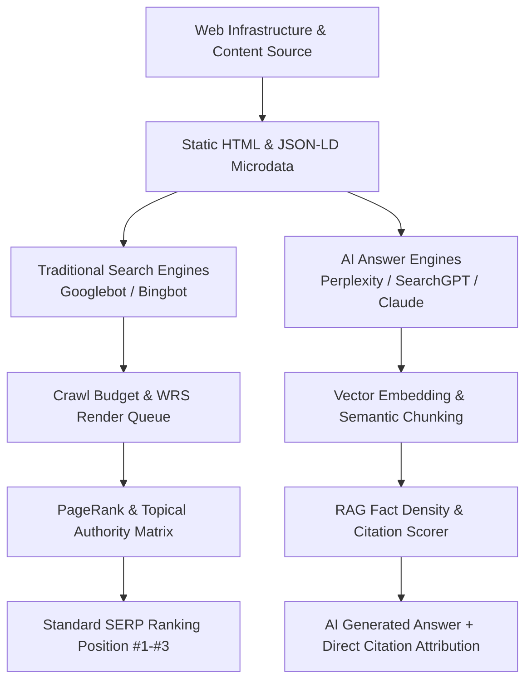

# 🔬 SEOER.AI // Generative Engine Optimization (GEO) & Search Engineering Spec

[](https://seoer.ai)
[](https://seoer.ai)
[](./LICENSE)

> **The definitive first-principles engineering specification for search engine mechanics, vector retrieval systems, LLM citation modeling, and algorithmic crawl science. Engineered for developers, AI architects, and search engineers. Powered by [seoer.ai](https://seoer.ai).**

---

## ⚡️ The Dual Search Engine Architecture: Traditional SERPs + AI RAG Engines

Modern search operates across two parallel paradigms: **Traditional Crawl-Based Indexing** (Google, Bing) and **Generative Vector Retrieval** (Perplexity AI, OpenAI SearchGPT, Claude, Google Gemini AI Overviews). Optimizing for both requires technical performance, structured semantic entities, and citeable factual density.



---

## 🔬 The 6 Technical Search Engineering Labs

Explore the core modules categorized into 6 specialized engineering disciplines:

### 🧬 Lab 1: Generative Engine Optimization (GEO) & AI Search
> *Optimizing content for vector retrieval, LLM citation scoring, and conversational answer engines.*

- 🤖 [**`ai-seo-and-geo`**](./ai-seo-and-geo/README.md): **Generative Engine Optimization (GEO) Spec** — Mathematical citation probability formulas, RAG vector retrieval optimization, AI answer block formatting, and `robots.txt` AI crawler permissions.
- 🗣️ [**`voice-and-conversational-search`**](./voice-and-conversational-search/README.md): **Conversational Search & Position 0** — Capturing Featured Snippets (Position 0), 40-word paragraph answer blocks, and `SpeakableSpecification` JSON-LD microdata.

---

### ⚡️ Lab 2: Crawl Science, Rendering & Log Forensics
> *Inspecting Googlebot WRS execution, HTTP response mechanics, and server log forensics.*

- ⚡️ [**`technical-seo`**](./technical-seo/README.md): **Technical Infrastructure & Rendering Mechanics** — 2-wave rendering pipelines (SSR vs CSR vs SSG), HTTP status code diagnostics (200/301/410/500), and TTFB < 50ms edge rendering.
- 🤖 [**`crawling-and-indexing`**](./crawling-and-indexing/README.md): **Crawl Budget & Indexation Directives** — Crawl rate limit math ($f(\text{Host Health}, \text{Demand})$), Meta Robots (`noindex, follow`), and eliminating parameter crawl leaks.
- 📋 [**`log-file-analysis`**](./log-file-analysis/README.md): **Server Log Forensics & Reverse DNS Verification** — Analyzing Nginx/Caddy access logs, CLI log parsing scripts, and verifying authentic Googlebot IP addresses.
- 🤖 [**`robots-and-sitemaps`**](./robots-and-sitemaps/README.md): **Robots.txt & XML Sitemap Protocols** — Production `robots.txt` syntax, XML sitemap 50k URL limits, and sitemap index chaining.

---

### 🧠 Lab 3: Semantic Knowledge Graphs & Entity Mapping
> *Structuring topical graphs, LSI co-occurrence, and internal PageRank channels.*

- 🧠 [**`semantic-seo-and-entities`**](./semantic-seo-and-entities/README.md): **Semantic SEO & Entity Knowledge Graphs** — Entity nodes, LSI semantic co-occurrence, mapping topic graphs, and establishing domain topical authority.
- 🏛️ [**`site-architecture`**](./site-architecture/README.md): **Site Hierarchy & SILO Structures** — 3-click max depth rules, SILO category isolation, and URL slug optimization.
- 🔄 [**`internal-linking`**](./internal-linking/README.md): **PageRank Distribution & Automated Link Loops** — Larry Page's PageRank equation ($PR(A)$), contextual anchor text optimization, and orphan page elimination.
- 🗺️ [**`content-strategy`**](./content-strategy/README.md): **Pillar-Cluster Topic Models & Content Decay** — Pillar-Cluster architectural blueprints, keyword cannibalization fixes, and content decay refresh workflows.

---

### 🏭 Lab 4: Programmatic SEO (pSEO) Data Pipelines
> *Engineering scalable static page generators and long-tail query capture systems.*

- 🏭 [**`programmatic-seo`**](./programmatic-seo/README.md): **Programmatic SEO (pSEO) Engine Architecture** — Data pipeline integration, dynamic static route compilation (`/vs/[competitor]`), dynamic OG card rendering, and Google Helpful Content anti-thin-content guards.
- 🎯 [**`keyword-research`**](./keyword-research/README.md): **Search Intent Classification Engine** — Classifying Informational, Commercial, Navigational, and Transactional intents, long-tail vs head keyword selection, and GSC opportunity mining.
- 📝 [**`on-page-seo`**](./on-page-seo/README.md): **On-Page Optimization Protocols** — 60-character high-CTR title tag formulas, strict single-H1 heading hierarchies, meta descriptions, and image ALT attributes.

---

### 📜 Lab 5: Microdata Engineering & Niche SEO
> *Implementing Schema.org JSON-LD microdata and specialized search domain architectures.*

- 📜 [**`schema-markup-and-structured-data`**](./schema-markup-and-structured-data/README.md): **Schema.org JSON-LD `@graph` Engineering** — Machine-readable microdata for `SoftwareApplication`, `FAQPage`, `TechArticle`, and `Organization` rich snippets.
- 🛒 [**`e-commerce-seo`**](./e-commerce-seo/README.md): **E-Commerce Search Engineering** — Faceted navigation crawl control, `Product/Offer` JSON-LD schemas, and out-of-stock product lifecycle management (301 vs 410).
- 📍 [**`local-seo`**](./local-seo/README.md): **Local Search & Business Profile Optimization** — Google Local 3-Pack ranking factors, NAP consistency protocols, and `LocalBusiness` JSON-LD microdata.
- 🌍 [**`international-seo`**](./international-seo/README.md): **Global SEO & Hreflang Architecture** — Subdirectory vs ccTLD trade-offs, reciprocal bi-directional `hreflang` tag rules, and avoiding forced IP redirects.

---

### 📊 Lab 6: Search Telemetry, Security & Auditing
> *Monitoring search analytics, front-end Core Web Vitals, HTTPS security, and backlink trust.*

- 🚀 [**`page-speed-and-core-web-vitals`**](./page-speed-and-core-web-vitals/README.md): **Core Web Vitals Engineering** — Optimizing LCP (< 2.5s), INP (< 200ms), and CLS (< 0.10) with image preloading, thread yielding, and aspect-ratio reservation.
- 🔍 [**`seo-auditing`**](./seo-auditing/README.md): **50-Point Technical Audit Protocol** — Systematic inspection protocol with priority severity scoring (Critical, High, Medium, Low).
- 📊 [**`search-console-analytics`**](./search-console-analytics/README.md): **Google Search Console Telemetry & API** — Impression/CTR analysis, position #8-#15 jump strategies, and GSC Search Analytics API query scripts.
- ✂️ [**`content-pruning-and-refresh`**](./content-pruning-and-refresh/README.md): **Content Pruning & Zombie Page Protocol** — Identifying zero-traffic zombie pages, 301 consolidation vs 410 Gone deletion protocols.
- 🔒 [**`security-and-https`**](./security-and-https/README.md): **HTTPS Security & Safe Browsing** — SSL/TLS auto-renewal, HSTS header configuration, and resolving mixed content security warnings.
- 🌐 [**`off-page-seo-and-backlinks`**](./off-page-seo-and-backlinks/README.md): **Backlink Acquisition & Trust Engineering** — High-DR backlink evaluation, engineering-as-marketing tools, unlinked brand mention reclamation, and `disavow.txt` syntax.
- 📱 [**`mobile-seo`**](./mobile-seo/README.md): **Mobile-First Indexing & Responsive Parity** — Mobile/Desktop content parity checks, 48px touch target accessibility, and eliminating intrusive mobile interstitials.
- ⚡️ [**`cheatsheet`**](./cheatsheet/README.md): **Search Engineering CLI Cheatsheet** — cURL user-agent simulation commands, Lighthouse CLI CI/CD runners, log analysis scripts, and master JSON-LD templates.

---

## ⚡️ Quick Terminal Diagnostic Commands

```bash
# 1. Inspect HTTP Headers as Googlebot Smartphone
curl -A "Mozilla/5.0 (Linux; Android 6.0.1; Nexus 5X Build/MMB29P) AppleWebKit/537.36 (KHTML, like Gecko) Chrome/120.0.0.0 Mobile Safari/537.36 (compatible; Googlebot/2.1; +http://www.google.com/bot.html)" -Iv https://seoer.ai

# 2. Run Headless Lighthouse Performance & SEO Audit
npx lighthouse https://seoer.ai --preset=desktop --only-categories=performance,seo --output=json --output-path=./audit.json

# 3. Verify Googlebot IP Legitimacy via Reverse DNS
host 66.249.66.1
```

---

## 📜 License & Open Source Contribution

This specification is open source under the [MIT License](./LICENSE). Contributions, technical benchmark scripts, and algorithm updates are welcome via Pull Requests. See [CONTRIBUTING.md](./CONTRIBUTING.md) and [CODE_OF_CONDUCT.md](./CODE_OF_CONDUCT.md).

*Maintained and powered by [seoer.ai](https://seoer.ai).*
