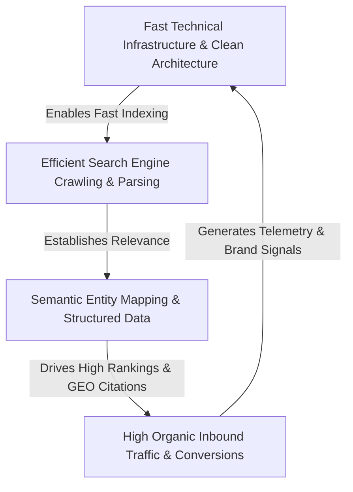
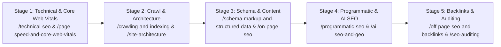

# 🔍 Modern SEO & Generative Engine Optimization (GEO) Master Knowledge Hub

[](https://seoer.ai)
[](https://seoer.ai)
[](./LICENSE)

> **A first-principles, developer-centric collection of technical SEO guides, crawl mechanics, Schema.org microdata, Programmatic SEO data pipelines, Core Web Vitals optimization, and AI Generative Engine Optimization (GEO) playbooks. Live portal: [seoer.ai](https://seoer.ai).**

---

## 🏷️ Repository Tags & Topics

`#seo` `#technical-seo` `#generative-engine-optimization` `#ai-seo` `#programmatic-seo` `#core-web-vitals` `#schema-markup` `#structured-data` `#search-engine-optimization` `#crawling-indexing` `#canonicalization` `#internal-linking` `#topical-authority` `#log-analysis` `#search-console` `#seoer-ai`

---

## 📌 Executive Overview & Search Engine Flywheel

Modern Search Engine Optimization (SEO) has evolved beyond keyword stuffing and backlink spam. Today, search engines and AI answer engines (ChatGPT, Perplexity, Google SGE) evaluate **technical performance**, **semantic entity relationships**, **structured microdata**, and **genuine user experience**.



---

## 📚 Master Knowledge Modules (26 Modules)

This repository is structured into **26 minimalist core modules**, covering every technical and strategic pillar of modern search optimization:

| Module | Core Topic & Focus Area | Target Audience | Primary Outcome |
| :--- | :--- | :--- | :--- |
| ⚡️ [**`technical-seo`**](./technical-seo/README.md) | **Technical SEO Fundamentals** | Developers & Search Engineers | Master HTTP response codes, rendering pipelines, and technical health checks. |
| 🤖 [**`crawling-and-indexing`**](./crawling-and-indexing/README.md) | **Crawl Mechanics & Indexing Directives** | Infrastructure Engineers | Optimize Googlebot crawl budget, rendering queues, and indexation status. |
| 🏛️ [**`site-architecture`**](./site-architecture/README.md) | **Site Hierarchy & SILO Structures** | Web Architects | Design flat site hierarchies, SILO structures, and page depth under 3 clicks. |
| 🚀 [**`page-speed-and-core-web-vitals`**](./page-speed-and-core-web-vitals/README.md) | **Core Web Vitals (LCP, INP, CLS)** | Front-End Developers | Achieve 100 PageSpeed scores, optimize LCP/INP/CLS, and eliminate layout shifts. |
| 🔗 [**`canonicalization`**](./canonicalization/README.md) | **Duplicate Content & Canonicalization** | Full-Stack Developers | Master `rel=canonical` tags, cross-domain canonicals, and URL parameter handling. |
| 📜 [**`schema-markup-and-structured-data`**](./schema-markup-and-structured-data/README.md) | **Schema.org & Rich Snippets** | Web Developers | Implement JSON-LD microdata for rich snippets, FAQs, products, and articles. |
| 🏭 [**`programmatic-seo`**](./programmatic-seo/README.md) | **Programmatic SEO (pSEO) Engines** | SaaS Builders & Engineers | Build static page generators, long-tail keyword databases, and dynamic routes. |
| 🤖 [**`ai-seo-and-geo`**](./ai-seo-and-geo/README.md) | **Generative Engine Optimization (GEO)** | AI Developers & Marketers | Optimize content for AI search engines (Perplexity, SearchGPT, Claude, SGE). |
| 🧠 [**`semantic-seo-and-entities`**](./semantic-seo-and-entities/README.md) | **Semantic SEO & Entity Graphs** | Content Strategists | Build topical authority, entity relationships, and LSI keyword clusters. |
| 🎯 [**`keyword-research`**](./keyword-research/README.md) | **Search Intent & Keyword Architecture** | Growth Marketers | Classify Informational, Commercial, Navigational, and Transactional queries. |
| 📝 [**`on-page-seo`**](./on-page-seo/README.md) | **On-Page Optimization Playbook** | Content Creators & Editors | Optimize H1-H6 tags, title formulas, meta descriptions, and image ALT tags. |
| 🗺️ [**`content-strategy`**](./content-strategy/README.md) | **Pillar-Cluster Content Models** | Growth Leads | Build Topic Clusters, content calendars, and prevent cannibalization. |
| 🔄 [**`internal-linking`**](./internal-linking/README.md) | **PageRank Distribution & Internal Links** | Site Architects | Distribute PageRank, optimize contextual anchor text, and automate link loops. |
| 🌐 [**`off-page-seo-and-backlinks`**](./off-page-seo-and-backlinks/README.md) | **Backlink Acquisition & Digital PR** | Outreach Marketers | Acquire high-DR backlinks, unlinked brand mentions, and disavow spam links. |
| 📍 [**`local-seo`**](./local-seo/README.md) | **Local Search & Google Business Profile** | Local Founders & Agencies | Rank in Google Local 3-Pack, optimize NAP consistency, and local schema. |
| 🛒 [**`e-commerce-seo`**](./e-commerce-seo/README.md) | **E-Commerce Search Optimization** | Store Developers | Optimize faceted navigation, product variant URLs, and Product schema. |
| 🌍 [**`international-seo`**](./international-seo/README.md) | **Global SEO & Hreflang Tags** | Internationalization Engineers | Implement `hreflang` tags, ccTLDs, subdomains, and geo-targeted routing. |
| 📱 [**`mobile-seo`**](./mobile-seo/README.md) | **Mobile-First Indexing & UX** | UX Engineers | Optimize for Google's mobile-first crawler, touch targets, and viewports. |
| 📋 [**`log-file-analysis`**](./log-file-analysis/README.md) | **Server Log File Analysis** | DevOps & System Admin | Analyze Googlebot user-agents, HTTP status codes, and crawl bottlenecks. |
| 🔍 [**`seo-auditing`**](./seo-auditing/README.md) | **Technical SEO Audit Framework** | SEO Auditors | Execute 50-point technical, content, and backlink audit checklists. |
| 📊 [**`search-console-analytics`**](./search-console-analytics/README.md) | **Google Search Console Diagnostics** | Search Analytics | Query GSC APIs, track CTR trends, and diagnose indexation drops. |
| ✂️ [**`content-pruning-and-refresh`**](./content-pruning-and-refresh/README.md) | **Content Pruning & Refresh Protocols** | Growth Editors | Identify zombie pages, execute 301 vs 410 rules, and update decaying posts. |
| 🔒 [**`security-and-https`**](./security-and-https/README.md) | **HTTPS, Security & Safe Browsing** | DevOps Engineers | Configure SSL/TLS certificates, HSTS headers, and fix mixed content errors. |
| 🤖 [**`robots-and-sitemaps`**](./robots-and-sitemaps/README.md) | **Robots.txt & XML Sitemap Engineering** | System Engineers | Author valid `robots.txt` rules, dynamic XML sitemaps, and ping search engines. |
| 🗣️ [**`voice-and-conversational-search`**](./voice-and-conversational-search/README.md) | **Voice Search & Featured Snippets** | Search Engineers | Capture Position 0 featured snippets and Speakable microdata. |
| ⚡️ [**`cheatsheet`**](./cheatsheet/README.md) | **SEO & GEO Developer CLI Cheatsheet** | Command-Line Developers | Googlebot cURL commands, Lighthouse CLI, JSON-LD templates & Robots.txt rules. |

---

## 🗺️ Recommended Execution Path

Follow this interactive Mermaid roadmap to navigate the knowledge base based on your optimization goals:



---

## ⚡️ Quick CLI Command Reference

```bash
# 1. Simulate Googlebot Desktop HTTP Request
curl -A "Mozilla/5.0 (compatible; Googlebot/2.1; +http://www.google.com/bot.html)" -Iv https://seoer.ai

# 2. Run Headless Lighthouse Performance & SEO Audit
npx lighthouse https://seoer.ai --only-categories=performance,seo,accessibility --output=json --output-path=./audit.json

# 3. Test Robots.txt Reachability & Response Headers
curl -s -D - https://seoer.ai/robots.txt -o /dev/null
```

---

## 📜 License & Open Contributions

This knowledge hub is open source under the [MIT License](./LICENSE). Contributions, case studies, and technical improvements are welcome via Pull Requests. Please see our [CONTRIBUTING.md](./CONTRIBUTING.md) and [CODE_OF_CONDUCT.md](./CODE_OF_CONDUCT.md).

---

*Maintained and powered by [seoer.ai](https://seoer.ai).*
