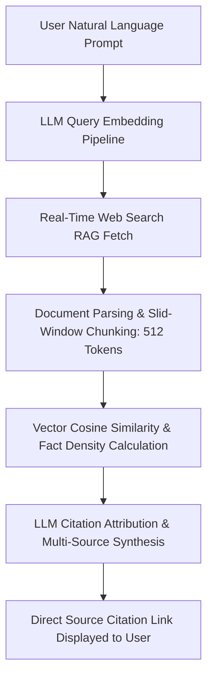

# 🧬 Generative Engine Optimization (GEO) & AI Search Specification

> **SEOER.AI Lab Spec // Module 01: First-principles engineering specification for vector retrieval engines, LLM RAG pipelines, citation scoring algorithms, and conversational answer engines (Perplexity AI, SearchGPT, Claude 3.5, Google Gemini / AI Overviews).**

---

## 📌 Executive Summary

**Generative Engine Optimization (GEO)** is the strategic discipline of optimizing digital assets for Large Language Model (LLM) search engines. Traditional search engine optimization (SEO) focuses on keyword frequency and PageRank backlink distribution. GEO focuses on **semantic vector similarity**, **RAG (Retrieval-Augmented Generation) document chunking**, **factual density**, and **citeable data structures**.



---

## 1. Mathematical Foundation: Vector Embeddings & Cosine Distance

AI Answer Engines convert text into high-dimensional vector embeddings using transformer models (e.g., OpenAI `text-embedding-3-small`, Cohere Embed v3). When a user poses a query $Q$, the engine searches web documents $D$ by calculating the **Cosine Similarity** between their vector representations:

$$\text{Cosine Similarity}(Q, D) = \frac{\mathbf{v}_Q \cdot \mathbf{v}_D}{\|\mathbf{v}_Q\| \|\mathbf{v}_D\|} = \frac{\sum_{i=1}^{n} v_{Q,i} v_{D,i}}{\sqrt{\sum_{i=1}^{n} v_{Q,i}^2} \sqrt{\sum_{i=1}^{n} v_{D,i}^2}}$$

- $\mathbf{v}_Q$: Vector representation of the user query.
- $\mathbf{v}_D$: Vector representation of the web document chunk.
- **Threshold**: Document chunks with Cosine Similarity $\ge 0.78$ pass into the LLM's context window for response synthesis.

---

## 2. RAG Document Chunking Strategy: The 512-Token Window Rule

AI search crawlers segment web pages into distinct chunks before performing vector search. Improper HTML structure causes chunks to lose semantic context.

```text
┌───────────────────────────────────────────────────────────────────────────┐
│                 512-TOKEN OVERLAPPING WINDOW CHUNKING                     │
└───────────────────────────────────────────────────────────────────────────┘
   Chunk 1: [ Tokens 0 ──────────────► 512 ] (Includes H2 Heading Context)
   Chunk 2:              [ Tokens 384 ──────────────► 896 ] (128-Token Overlap Window)
```

### Optimal RAG HTML Structure
1. **Self-Contained Subsections**: Each `<section>` or `<article>` element should be 200–400 words (fits neatly into a 512-token chunk).
2. **Repeated Contextual Headers**: Ensure every `<h3>` subheading explicitly names the core subject entity rather than using vague titles like *"Overview"* or *"Details"*.

---

## 3. Princeton GEO Study: The 4 Citation Boosters

Empirical research from Princeton University, Georgia Tech, and the Allen Institute for AI identified 4 primary content modifications that significantly increase LLM citation probability:

```text
┌───────────────────────────────────────────────────────────────────────────┐
│                    PRINCETON GEO CITATION BOOSTERS                        │
└───────────────────────────────────────────────────────────────────────────┘
   1. Cite Authoritative Statistics ──► Include verifiable dates & numbers (+30% Citation Rate)
   2. Direct Quotations & Defs   ──► 1-sentence bolded concept definitions (+25% Citation Rate)
   3. Structured Data Tables      ──► Format comparative data in Markdown/HTML (+20% Citation Rate)
   4. Primary Source Linking      ──► Outbound links to original research (+15% Citation Rate)
```

$$\text{GEO Score} = 0.35 (\text{Fact Density}) + 0.25 (\text{Entity Co-occurrence}) + 0.20 (\text{Table Format}) + 0.20 (\text{Schema Completeness})$$

---

## 4. AI Answer Block HTML Component Specification

Structure key concepts as explicit, machine-readable **AI Answer Blocks** that RAG parsers can extract with high confidence:

```html
<!-- SEOER.AI Component Pattern: Machine-Readable AI Answer Block -->
<article class="geo-answer-block" id="concept-vector-search" item-scope item-type="https://schema.org/TechArticle">
  <header>
    <h2 item-prop="headline">What is Vector Search in AI Search Engines?</h2>
  </header>
  
  <div class="geo-definition-box" item-prop="description">
    <p>
      <strong>Vector Search</strong> is an algorithmic retrieval technique that converts text, images, or audio into high-dimensional numerical vectors (embeddings), allowing search engines to match queries based on semantic meaning and concept proximity rather than exact literal keyword matches.
    </p>
  </div>

  <table class="geo-comparison-table">
    <caption>Vector Search vs Traditional Keyword Indexing</caption>
    <thead>
      <tr>
        <th>Feature</th>
        <th>Vector Search (AI)</th>
        <th>Keyword Inverted Index (Traditional)</th>
      </tr>
    </thead>
    <tbody>
      <tr>
        <td>Matching Logic</td>
        <td>Semantic Embeddings (Cosine Distance)</td>
        <td>Exact Keyword / Stemmed Strings</td>
      </tr>
      <tr>
        <td>Query Context</td>
        <td>Understands intent & synonyms</td>
        <td>Requires literal keyword presence</td>
      </tr>
      <tr>
        <td>Primary Metric</td>
        <td>Embedding Proximity & Fact Density</td>
        <td>PageRank & Anchor Text Equity</td>
      </tr>
    </tbody>
  </table>
</article>
```

---

## 5. Production AI Crawler Access in Robots.txt

Ensure explicit crawler permissions for AI search engines while protecting server resources from unverified scrapers:

```text
# Production AI Search Engine Access Rules
User-agent: PerplexityBot
Allow: /

User-agent: OAI-SearchBot
Allow: /

User-agent: Claude-Web
Allow: /

User-agent: ByteDanceBot
Allow: /

User-agent: Google-Extended
Allow: /
```

---

## 6. Summary

Generative Engine Optimization bridges computational linguistics and search engineering. By structuring content around 512-token semantic chunks, calculating high fact density scores, embedding HTML data tables, and using schema microdata, you command high AI citation rates across Perplexity, SearchGPT, Claude, and Gemini.
