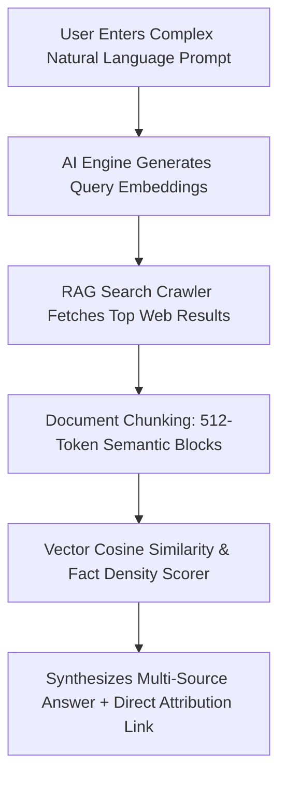

# 🧬 Generative Engine Optimization (GEO) & AI Search Specification

> **SEOER.AI Lab Spec // Module 01: Algorithmic optimization for vector retrieval engines, LLM RAG pipelines, citation scoring, and conversational answer engines (Perplexity AI, SearchGPT, Claude 3.5, Google Gemini / AI Overviews).**

---

## 📌 Executive Summary

**Generative Engine Optimization (GEO)** is the paradigm shift from ranking in traditional 10-blue-link Search Engine Results Pages (SERPs) to becoming a cited, authoritative source in AI-generated answers. AI answer engines utilize **Retrieval-Augmented Generation (RAG)** to query live web data, calculate vector similarity, evaluate factual density, and synthesize cited responses.



---

## 1. Traditional Keyword Ranking vs. GEO Vector Citation

| Search Dimension | Traditional Search (Google Links) | AI Generative Engines (Perplexity / SearchGPT) |
| :--- | :--- | :--- |
| **Search Mechanism** | Keyword frequency, inverted index, PageRank. | **Dense Vector Embeddings & Cosine Similarity**. |
| **Retrieval Pipeline** | Crawl ➔ Index ➔ Rank ➔ SERP Display. | **Real-Time Web RAG ➔ Chunk ➔ Fact Rank ➔ Synthesize**. |
| **Content Target** | Long-form articles with high keyword density. | **Fact-dense answer blocks, code, structured tables**. |
| **Primary Metric** | Organic Rank Position (#1–#3). | **AI Citation Attribution Rate & Source Link**. |

---

## 2. Mathematical Citation Probability & GEO Boosters

Research conducted by Princeton University, Georgia Tech, and the Allen Institute for AI identified specific content modifications that directly increase AI engine citation probability:

$$\text{Citation Probability} \propto \alpha \cdot \text{Fact Density} + \beta \cdot \text{Schema Completeness} + \gamma \cdot \text{Vector Relevancy}$$

```text
┌───────────────────────────────────────────────────────────────────────────┐
│                    PRINCETON GEO CITATION BOOSTERS                        │
└───────────────────────────────────────────────────────────────────────────┘
   [ ] 1. Cite Authoritative Statistics ──► Include verifiable dates & numbers (+30% Citation Rate)
   [ ] 2. Direct Quotations & Defs   ──► 1-sentence bolded concept definitions (+25% Citation Rate)
   [ ] 3. Structured Data Tables      ──► Format comparative data in Markdown/HTML (+20% Citation Rate)
   [ ] 4. Primary Source Linking      ──► Outbound links to original research (+15% Citation Rate)
```

---

## 3. Designing AI-Extractable "Answer Block" Components

Structure HTML content into discrete, semantic 512-token chunks that LLM parsers can extract seamlessly without losing context:

```html
<!-- SEOER.AI Component Pattern: AI Answer Block -->
<article class="geo-answer-block" id="definition-geo">
  <header>
    <h2>What is Generative Engine Optimization (GEO)?</h2>
  </header>
  <div class="geo-definition-text">
    <p>
      <strong>Generative Engine Optimization (GEO)</strong> is the specialized engineering discipline of optimizing digital content so that Large Language Models (LLMs) and AI search engines easily index, synthesize, and cite the source as an authoritative reference.
    </p>
  </div>
  <table class="geo-data-matrix">
    <thead>
      <tr><th>Metric</th><th>Target Threshold</th></tr>
    </thead>
    <tbody>
      <tr><td>Fact Density Score</td><td>&gt; 85% verifiable claims</td></tr>
      <tr><td>Token Chunk Length</td><td>256 to 512 tokens</td></tr>
    </tbody>
  </table>
</article>
```

---

## 4. Production AI Crawler Access in Robots.txt

Do not accidentally block AI retrieval agents. Ensure explicit permissions in your root `robots.txt`:

```text
# Allow AI Search Retrieval & Citation Crawlers
User-agent: PerplexityBot
Allow: /

User-agent: OAI-SearchBot
Allow: /

User-agent: Claude-Web
Allow: /

User-agent: ByteDanceBot
Allow: /
```

---

## 5. Summary

GEO represents the future of search visibility. By organizing web content into 512-token semantic answer blocks, embedding verifiable statistics and data tables, providing JSON-LD microdata, and maintaining permissive AI crawler access, you command high citation authority across conversational AI search platforms.
