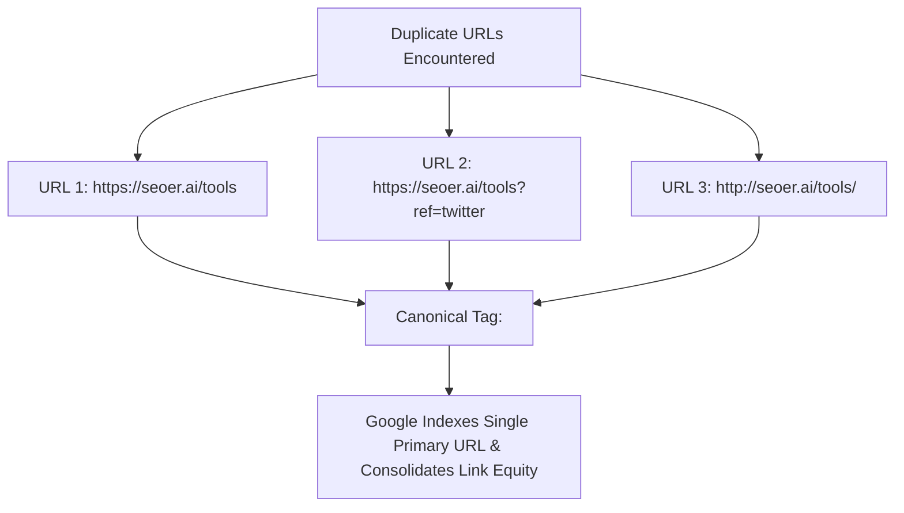

# 🔗 Canonicalization & Duplicate Content Architecture

> **SEOER.AI Lab Spec // Module 24: First-principles engineering specification for `rel=canonical` implementation, handling duplicate URLs, cross-domain canonicals, and URL parameter optimization.**

---

## 📌 Executive Summary

**Canonicalization** is the process of specifying the authoritative primary URL for content accessible across multiple web addresses. When search engine crawlers encounter duplicate or near-identical content at different URLs, canonical tags instruct search engines which single URL to index and consolidate PageRank link equity toward.



---

## 1. How Canonical Tags Work

Place a self-referencing or cross-referencing `<link rel="canonical">` tag in the `<head>` section of every HTML document:

```html
<!-- On page: https://seoer.ai/tools?source=newsletter -->
<link rel="canonical" href="https://seoer.ai/tools" />
```

### HTTP Response Header Canonical (For Non-HTML Files)
For PDF documents, images, or JSON API files, specify canonical URLs using the `Link` HTTP header:
```text
Link: <https://seoer.ai/docs/whitepaper.pdf>; rel="canonical"
```

---

## 2. Common Duplicate Content Scenarios & Solutions

| Duplicate Scenario | Example URLs | Canonical Solution |
| :--- | :--- | :--- |
| **HTTP vs HTTPS / WWW vs Non-WWW** | `http://site.com` vs `https://site.com` | Use 301 server redirects to 1 primary version + self-referencing canonical. |
| **Trailing Slash Inconsistency** | `/products` vs `/products/` | Standardize on 1 version (e.g., with trailing slash) + 301 redirect the other. |
| **Tracking & Campaign Parameters** | `/page?utm_source=google&utm_medium=cpc` | Canonicalize back to clean base URL `/page`. |
| **Faceted E-Commerce Filters** | `/shoes?color=blue&size=10` | Canonicalize to root category `/shoes` (or index specific high-volume queries). |
| **Cross-Domain Syndication** | Medium / Dev.to re-post of original blog | Cross-domain canonical pointing back to original blog URL. |

---

## 3. The 4 Golden Rules of Canonicalization

1. **Always Use Absolute URLs**: Never use relative paths (`/page`); always specify `https://seoer.ai/page`.
2. **Self-Referencing Canonical**: Every unique canonical page MUST contain a self-referencing canonical tag.
3. **One Canonical Per Page**: Including multiple canonical tags on a single page causes search engines to ignore all of them!
4. **Do Not Canonicalize Across 404 or Redirect Pages**: Point canonical tags only to live HTTP 200 OK target pages.

---

## 4. Summary

Canonicalization prevents duplicate content penalties and consolidates PageRank. By enforcing self-referencing canonical tags, standardizing trailing slashes, and stripping tracking parameters, you maintain clean indexation across your entire domain.
