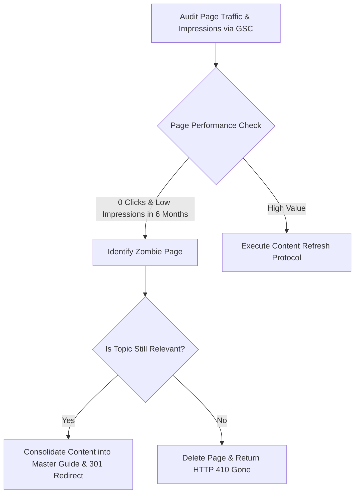

# ✂️ Content Pruning & Zombie Page Deletion Protocols

> **SEOER.AI Lab Spec // Module 20: First-principles engineering specification for content pruning, identifying low-value "zombie" pages, HTTP 301 vs 410 redirect protocols, and crawl budget reclamation.**

---

## 📌 Executive Summary

More content is not always better. Having hundreds of low-traffic, outdated, or thin pages ("zombie pages") dilutes your domain's topical authority and wastes crawl budget. **Content Pruning** is the strategic removal or consolidation of low-performing pages to concentrate search engine authority into high-quality master resources.



---

## 1. Defining "Zombie Pages"

A **Zombie Page** is an active, indexable URL that contributes zero SEO value:
- Zero organic visits over the past 6 to 12 months.
- Outdated technical information or dead code examples.
- Thin content under 300 words with no unique data.

---

## 2. The 3-Option Content Pruning Matrix

```text
┌───────────────────────────────────────────────────────────────────────────┐
│                       CONTENT PRUNING DECISION TREE                       │
└───────────────────────────────────────────────────────────────────────────┘
   Option 1: Refresh & Upgrade  ──► Add new data, fix code, update Schema.
   Option 2: Merge & Redirect   ──► Combine 3 thin posts into 1 + HTTP 301 redirect.
   Option 3: Delete & Prune     ──► Remove useless page + Return HTTP 410 Gone.
```

| Decision | Action Taken | HTTP Protocol | Expected Outcome |
| :--- | :--- | :--- | :--- |
| **Refresh** | Expand depth, update date, add images. | Keep HTTP 200 OK | Organic traffic recovers. |
| **Consolidate** | Merge 3 thin posts into 1 comprehensive guide. | **HTTP 301 Permanent Redirect** | Consolidates PageRank into master page. |
| **Delete** | Remove outdated, irrelevant non-value URL. | **HTTP 410 Gone** | Fast removal from index; saves crawl budget. |

---

## 3. HTTP 301 vs. HTTP 410 Redirect Protocol

- **Use 301 Redirect**: When an equivalent or better target page exists on your site (`Old URL -> New Master URL`).
- **Use 410 Gone**: When a page is permanently deleted and NO relevant replacement exists. HTTP 410 explicitly tells crawlers *"This page was deliberately destroyed; stop re-crawling it."*

---

## 4. Summary

Pruning thin content strengthens overall domain authority. By systematically removing zombie pages, consolidating duplicate topics via 301 redirects, and returning HTTP 410 Gone for dead content, you elevate your site's average content quality score.
