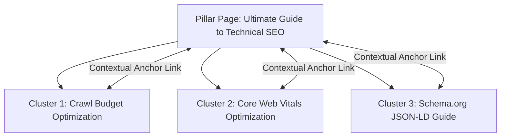
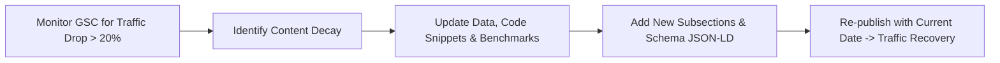

# 🗺️ Content Strategy & Pillar-Cluster Architecture

> **SEOER.AI Lab Spec // Module 19: First-principles engineering specification for content strategy, Pillar-Cluster topic models, preventing keyword cannibalization, and content decay refresh workflows.**

---

## 📌 Executive Summary

An effective **SEO Content Strategy** is a structured architecture for acquiring **Topical Authority** through **Pillar-Cluster Topic Models**. By grouping content around central pillar topics and supporting sub-topic cluster articles, search engines recognize your domain as a comprehensive subject authority.



---

## 1. The Pillar-Cluster Content Architecture

```text
┌───────────────────────────────────────────────────────────────────────────┐
│                      THE PILLAR-CLUSTER TOPIC MODEL                       │
└───────────────────────────────────────────────────────────────────────────┘
   1. Pillar Page:    Comprehensive 3,000+ word ultimate guide targeting head keyword.
   2. Cluster Pages:   10 to 20 detailed sub-posts targeting long-tail keywords.
   3. Internal Links:  All clusters link back to the Pillar Page using primary anchors.
```

| Component | Target Keyword Type | Word Count | Purpose |
| :--- | :--- | :--- | :--- |
| **Pillar Page** | Broad Head Keyword (*"Programmatic SEO"*) | 2,500 – 4,000 words | Ultimate reference hub for a major topic. |
| **Cluster Articles** | Long-tail Queries (*"pSEO templates for Next.js"*) | 1,000 – 1,800 words | Answers specific user questions; passes authority up. |

---

## 2. Resolving Keyword Cannibalization

**Keyword Cannibalization** occurs when multiple pages on your domain target the exact same search query. This confuses search engines, causes fluctuating rankings, and splits PageRank equity.

### 3-Step Cannibalization Resolution Engine
1. **Audit Duplicate Intent**: Search your domain using `site:seoer.ai "target keyword"`.
2. **Consolidate (301 Redirect)**: Merge thin duplicate posts into 1 comprehensive master pillar post and 301 redirect the old URLs.
3. **Re-target Sub-pages**: Modify titles and headings of secondary pages so they target distinct long-tail sub-intents.

---

## 3. Content Decay Tracking & 90-Day Refresh Protocol

Over time, articles lose search rankings due to **Content Decay** (outdated data, dead links, declining engagement, or new competitor entries).



### Content Refresh Checklist
- [ ] Update out-of-date statistics, screenshots, and code snippets.
- [ ] Fix broken internal and external links (HTTP 404).
- [ ] Add 2–3 new subsections answering recent user questions from Reddit/forums.
- [ ] Update the `dateModified` property in your Schema.org JSON-LD microdata.

---

## 4. Summary

Content strategy is an architectural discipline. By organizing articles into structured Topic Clusters around core Pillar pages, eliminating keyword cannibalization, and systematically refreshing decaying content, you compound domain search authority over time.
