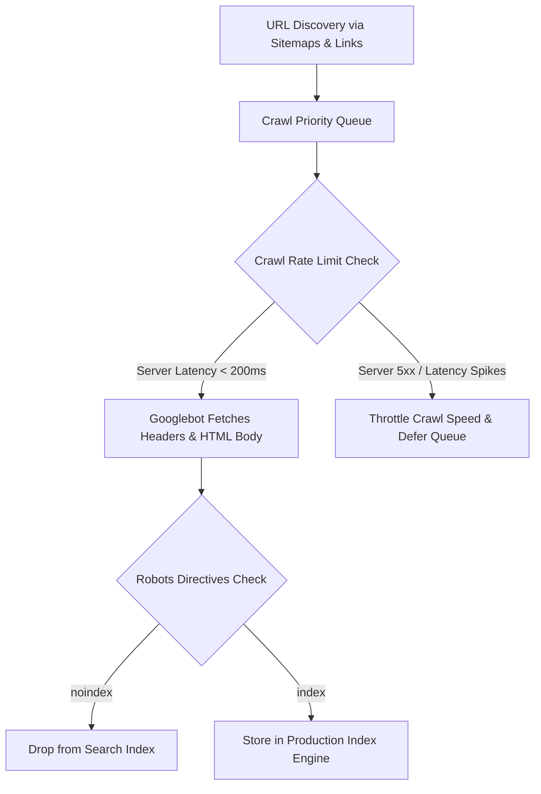

# 🤖 Crawling & Indexing Mechanics: Crawl Budget & Directives

> **SEOER.AI Lab Spec // Module 08: First-principles engineering specification for search crawler mechanics, Googlebot crawl budget allocation, rendering queues, meta robots directives, and Soft 404 detection heuristics.**

---

## 📌 Executive Summary

Before a search engine can rank your software, it must **crawl** (discover and fetch) your HTTP endpoints and **index** (parse and store) your document nodes in its search index database. For large web applications (>10,000 pages), managing **Crawl Budget**—the maximum number of URLs Googlebot is willing and able to crawl on your origin server per day—is critical to preventing indexing delays.



---

## 1. Mathematical Model of Crawl Budget Allocation

Googlebot calculates Crawl Budget as a function of server health and domain demand:

$$\text{Crawl Budget} = f(\text{Crawl Rate Limit}, \text{Crawl Demand})$$

$$\text{Crawl Rate Limit} = k \cdot \left( \frac{1}{\text{TTFB}} \right) \cdot (1 - \text{Error Rate}_{5xx})$$

- **Time-To-First-Byte (TTFB)**: As origin server latency increases, Googlebot immediately reduces parallel HTTP connections.
- **Error Rate ($5xx$)**: If server error rates exceed $1\%$, Googlebot throttles crawl frequency exponentially to avoid crashing your infrastructure.

---

## 2. Meta Robots & X-Robots-Tag Directives Matrix

Directives instruct search crawlers whether to store a page or follow its outbound links.

```text
┌───────────────────────────────────────────────────────────────────────────┐
│                      META ROBOTS DIRECTIVES SYNTAX                        │
└───────────────────────────────────────────────────────────────────────────┘
   <meta name="robots" content="index, follow">                 <── Default
   <meta name="robots" content="noindex, follow">               <── Prune Page
   <meta name="robots" content="noindex, nofollow">             <── Total Block
   Header: X-Robots-Tag: noindex, nofollow                      <── Non-HTML PDFs
```

| Directive | Crawler Behavior | Target Use-Case |
| :--- | :--- | :--- |
| `index, follow` | Crawl, store in search index, follow links. | Primary landing pages & documentation. |
| `noindex, follow` | Remove page from index, but crawl outbound links. | Search results pages, paginated archives. |
| `noindex, nofollow` | Remove page from index AND ignore outbound links. | Internal admin panels, user dashboards. |
| `max-snippet:-1` | Allow search engine to choose snippet length. | **Optimizing for Google AI Overviews / SGE.** |

---

## 3. Soft 404 Detection Heuristics

A **Soft 404 Error** occurs when a server returns HTTP 200 OK for a page that actually contains no content or displays a *"Product Not Found"* message.

### Soft 404 Detection Heuristic Algorithm
```javascript
// Heuristic Soft 404 Detection Script
function isSoft404(html, bodyText) {
  const thinTextThreshold = 200; // Words
  const errorPhrases = ["not found", "out of stock", "no results", "does not exist"];

  const wordCount = bodyText.trim().split(/\s+/).length;
  const containsErrorPhrase = errorPhrases.some(phrase => bodyText.toLowerCase().includes(phrase));

  if (wordCount < thinTextThreshold && containsErrorPhrase) {
    return true; // Flag as Soft 404 -> Server MUST return HTTP 404/410!
  }
  return false;
}
```

---

## 4. Summary

Managing crawling and indexing is essential for large-scale web applications. By optimizing server latency (TTFB < 200ms), enforcing explicit `noindex` directives on non-canonical pages, and eliminating Soft 404 errors, you ensure Googlebot spends 100% of its budget indexing your highest-value pages.
