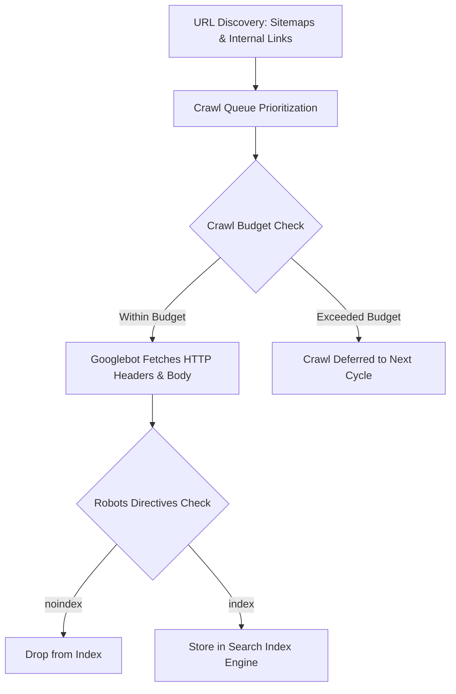

# Crawling & Indexing Mechanics: Crawl Budget, Bot Behavior & Directives

> **A first-principles guide to search engine crawler mechanics, Googlebot crawl budget optimization, rendering queues, and meta robots indexing directives.**

---

## 📌 Executive Summary

Before a search engine can rank your content, it must **crawl** (discover and fetch) your URLs and **index** (parse and store) them in its search database. For large web applications (>10,000 pages), managing **Crawl Budget**—the number of URLs Googlebot is willing and able to crawl on your site per day—is critical to preventing indexing delays.



---

## 1. The 2 Determinants of Crawl Budget

Googlebot allocates Crawl Budget based on two fundamental variables:

$$\text{Crawl Budget} = f(\text{Crawl Rate Limit}, \text{Crawl Demand})$$

1. **Crawl Rate Limit (Host Health)**: The maximum fetch velocity Googlebot can exert without crashing your origin server. If your Time-To-First-Byte (TTFB) increases or your server returns HTTP 500/503 errors, Googlebot automatically slows down crawl speed.
2. **Crawl Demand (Popularity & Freshness)**: How frequently your URLs are updated and how many external backlinks point to them.

---

## 2. Meta Robots & X-Robots-Tag Directives Matrix

Directives dictate whether crawlers may index a page or follow its links.

```text
┌───────────────────────────────────────────────────────────────────────────┐
│                      META ROBOTS DIRECTIVES SYNTAX                        │
└───────────────────────────────────────────────────────────────────────────┘
   <meta name="robots" content="index, follow">                 <── Default
   <meta name="robots" content="noindex, follow">               <── Prune Page
   <meta name="robots" content="noindex, nofollow">             <── Total Block
   Header: X-Robots-Tag: noindex, nofollow                      <── Non-HTML PDFs
```

| Directive | Crawler Behavior | Best Used For |
| :--- | :--- | :--- |
| `index, follow` | Crawl page, add to index, follow internal links. | Standard public content & landing pages. |
| `noindex, follow` | Remove page from index, but crawl internal links. | Internal search pages, paginated archives. |
| `noindex, nofollow` | Remove page from index AND ignore internal links. | Admin panels, private user dashboards. |
| `noarchive` | Prevent search engines from showing cached copy. | Proprietary or time-sensitive paid content. |
| `max-snippet: -1` | Allow search engine to choose snippet length. | Optimizing for Google AI Overviews / SGE. |

---

## 3. Crawl Budget Waste Wasted Categories

Fix these 4 common technical leaks that consume crawler bandwidth needlessly:

1. **Faceted Navigation / Filter Combinations**: Creating millions of duplicate URLs (`/shop?color=red&size=m&sort=price_asc`).
2. **Session Identifiers & Tracking Parameters**: URLs containing session IDs or UTM tags without canonical tags.
3. **Soft 404 Pages**: Pages returning HTTP 200 OK but displaying *"Product Not Found"* or empty results text.
4. **Infinite Redirection Loops**: 301 redirect chains (`A -> B -> C -> D`) that waste crawler requests.

---

## 4. Summary

Optimizing crawling and indexing requires protecting your crawl budget. By maintaining low server latency (TTFB < 200ms), eliminating parameter duplication, and deploying precise `noindex` directives, you ensure Googlebot spends 100% of its budget on your highest-value pages.
