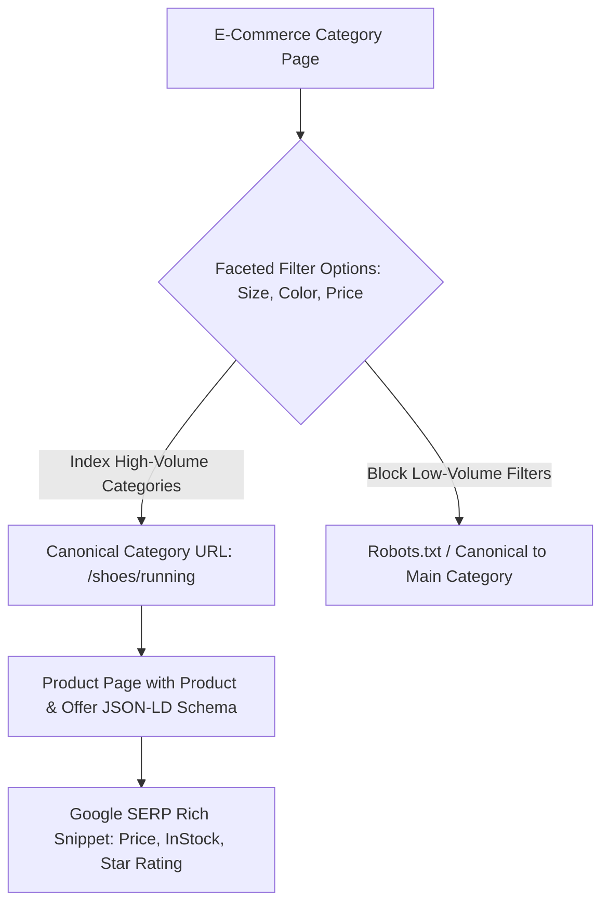

# E-Commerce SEO: Faceted Navigation & Product Schema

> **A first-principles guide to E-Commerce SEO, faceted navigation crawling rules, out-of-stock product management, and Product/Offer Schema.org microdata.**

---

## 📌 Executive Summary

**E-Commerce SEO** involves optimizing online store architectures with thousands of product pages, category grids, and dynamic filter parameters. The biggest technical challenges in E-Commerce SEO are **faceted navigation crawl budget bloat**, duplicate variant content, out-of-stock management, and implementing Product/Offer rich snippet microdata.



---

## 1. Managing Faceted Navigation Crawl Bloat

Faceted navigation allows users to filter products by multiple attributes (e.g., `/shop?category=shoes&color=red&size=10&price=50-100`). This can generate millions of URL combinations, consuming your entire crawl budget.

```text
┌───────────────────────────────────────────────────────────────────────────┐
│                    FACETED NAVIGATION CONTROL MATRIX                      │
└───────────────────────────────────────────────────────────────────────────┘
   1. High-Search Categories:   Build dedicated SEO routes (/shoes/red-running-shoes).
   2. Multi-Filter Combinations: Canonicalize back to main category (/shoes).
   3. Thin Parameter Filters:    Block crawling via Robots.txt or AJAX filters.
```

---

## 2. Product & Offer Schema.org Microdata

Drive eye-catching price, stock status, and review stars in Google search results by embedding `Product` JSON-LD microdata:

```html
<script type="application/ld+json">
{
  "@context": "https://schema.org",
  "@type": "Product",
  "name": "High-Performance Go Runtime Engine",
  "image": "https://seoer.ai/product.png",
  "description": "Zero-dependency Go web runtime with custom VM.",
  "sku": "KITWORK-001",
  "offers": {
    "@type": "Offer",
    "url": "https://seoer.ai/pricing",
    "priceCurrency": "USD",
    "price": "29.00",
    "availability": "https://schema.org/InStock"
  },
  "aggregateRating": {
    "@type": "AggregateRating",
    "ratingValue": "4.9",
    "reviewCount": "84"
  }
}
</script>
```

---

## 3. Managing Out-of-Stock Products

Never delete out-of-stock product pages immediately—that destroys accumulated PageRank link equity!

| Out-of-Stock Status | Best SEO Action |
| :--- | :--- |
| **Temporarily Out of Stock** | Keep page live (HTTP 200), update Schema `availability` to `OutOfStock`, show related products. |
| **Permanently Discontinued** | If replacement exists: 301 redirect to newer model. If no replacement: Return HTTP 410 Gone. |

---

## 4. Summary

E-Commerce SEO demands strict technical discipline. By controlling faceted navigation URL bloat, managing out-of-stock lifecycle redirects, and implementing rich Product/Offer JSON-LD schemas, you secure high-converting product search listings.
