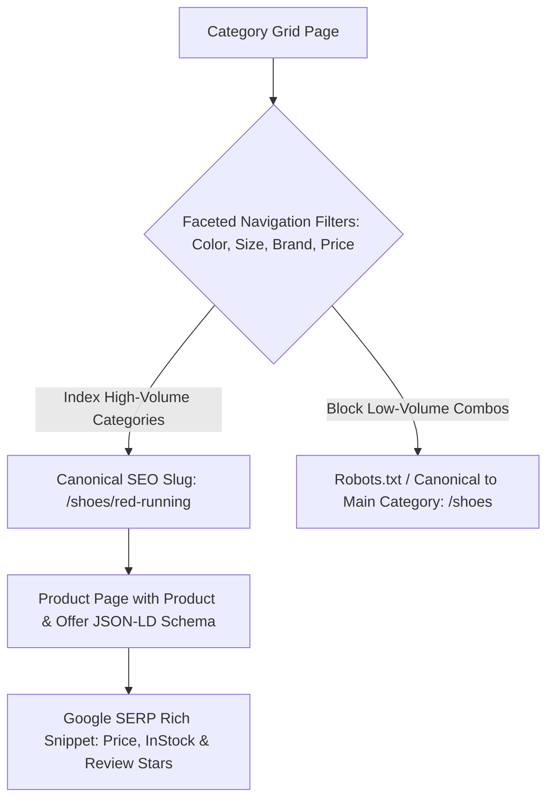

# 🛒 E-Commerce Search Engineering & Faceted Navigation

> **SEOER.AI Lab Spec // Module 13: First-principles engineering specification for E-Commerce SEO, faceted navigation combinatorial explosion control, out-of-stock product lifecycle management, and Product/Offer JSON-LD microdata.**

---

## 📌 Executive Summary

**E-Commerce Search Engineering** involves optimizing online catalog architectures containing thousands of product SKUs, dynamic category grids, and multi-attribute filters. The primary technical challenges in E-Commerce SEO are **faceted navigation crawl budget bloat**, duplicate variant URLs, managing out-of-stock items without destroying PageRank, and embedding structured `Product`/`Offer` JSON-LD microdata.



---

## 1. Combinatorial Explosion in Faceted Navigation

Enabling multi-select filters on category pages generates a combinatorial explosion of unique URLs that exhausts Googlebot's crawl budget:

$$\text{Total Facet Combinations} = \sum_{k=1}^{n} \binom{n}{k} = 2^n - 1$$

- $n$: Number of available filter attributes (e.g., $10$ filters: size, color, brand, material, price, tag, rating, etc.).
- **Result**: $2^{10} - 1 = 1,023$ unique URL permutations for a *single* category page! Across 50 categories, this creates $51,150$ duplicate URLs!

```text
┌───────────────────────────────────────────────────────────────────────────┐
│                    FACETED NAVIGATION CONTROL MATRIX                      │
└───────────────────────────────────────────────────────────────────────────┘
   1. High-Search Facets (e.g., "Red Shoes"): Build SEO routes (/shoes/red).
   2. Multi-Filter Combinations:               Canonicalize back to /shoes.
   3. Thin Parameter Filters (?sort=price):    Block crawling via Robots.txt or AJAX.
```

---

## 2. Production Product & Offer Schema.org Microdata

Earn rich product snippets (star ratings, pricing, in-stock badges) in Google SERPs:

```html
<script type="application/ld+json">
{
  "@context": "https://schema.org",
  "@type": "Product",
  "name": "High-Performance Go Runtime Engine",
  "image": "https://seoer.ai/assets/engine.png",
  "description": "Zero-dependency Go web runtime with custom VM.",
  "sku": "KITWORK-GO-001",
  "brand": {
    "@type": "Brand",
    "name": "seoer.ai"
  },
  "offers": {
    "@type": "Offer",
    "url": "https://seoer.ai/pricing",
    "priceCurrency": "USD",
    "price": "29.00",
    "itemCondition": "https://schema.org/NewCondition",
    "availability": "https://schema.org/InStock"
  },
  "aggregateRating": {
    "@type": "AggregateRating",
    "ratingValue": "4.95",
    "reviewCount": "142"
  }
}
</script>
```

---

## 3. Out-of-Stock Product Lifecycle Management

Never delete out-of-stock product URLs immediately—deleting URLs destroys accumulated PageRank link equity!

| Product Availability State | Correct HTTP Status | Required Action |
| :--- | :--- | :--- |
| **Temporarily Out of Stock** | **HTTP 200 OK** | Keep page live, update Schema `availability` to `OutOfStock`, display alternative products. |
| **Permanently Discontinued (Replacement Exists)** | **HTTP 301 Redirect** | Permanently 301 redirect old URL to the updated replacement model. |
| **Permanently Discontinued (No Replacement)** | **HTTP 410 Gone** | Explicitly return HTTP 410 Gone to prune URL from index quickly. |

---

## 4. Summary

E-Commerce SEO requires strict architectural control over URL generation. By capping faceted navigation combinatorial explosions, managing out-of-stock lifecycle redirects, and providing valid Product/Offer JSON-LD microdata, you capture high-converting transactional traffic.
