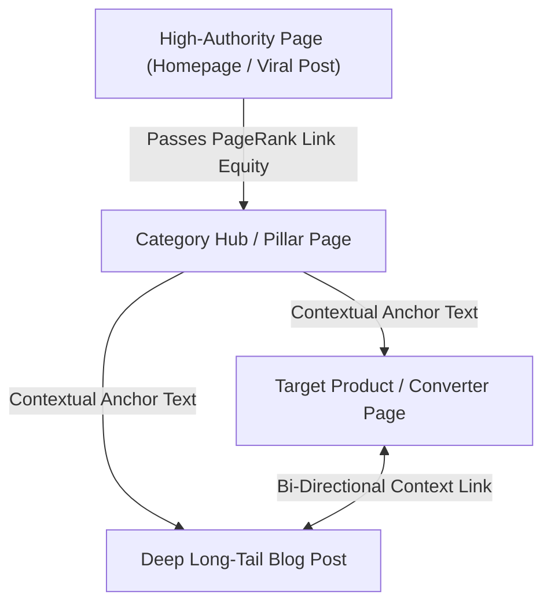

# Internal Linking Architecture & PageRank Distribution

> **A first-principles guide to internal linking, PageRank algorithms, contextual anchor text optimization, and automated internal link loops.**

---

## 📌 Executive Summary

**Internal Linking** connects pages on the same domain using HTML hyperlinks (`<a href="...">`). Internal links are the channels through which search engines discover new content, understand contextual relationships between pages, and distribute **PageRank** (link equity) across your entire domain.



---

## 1. The Physics of PageRank Distribution

Search engines calculate the relative authority of every web page using variants of Larry Page's **PageRank algorithm**:

$$PR(A) = \frac{1-d}{N} + d \sum_{i} \frac{PR(T_i)}{C(T_i)}$$

- **$PR(A)$**: The PageRank of page $A$.
- **$d$ (Damping Factor)**: Typically set to $0.85$.
- **$C(T_i)$**: The total number of outbound links on linking page $T_i$.

> **PageRank Rule**: The more outbound links a page has, the less PageRank equity each individual link passes. Keep outbound links focused and contextually relevant.

---

## 2. Contextual Anchor Text Optimization

The clickable text inside a hyperlink (**Anchor Text**) communicates strong topical relevance signals to search algorithms.

```html
<!-- BAD Anchor Text Patterns (Generic / Non-Descriptive) -->
<a href="/seo/crawl-budget">click here</a>
<a href="/seo/crawl-budget">read more</a>
<a href="/seo/crawl-budget">link</a>

<!-- GOOD Anchor Text Patterns (Contextual & Keyword-Rich) -->
<a href="/seo/crawl-budget">Googlebot crawl budget optimization guide</a>
<a href="/seo/crawl-budget">learn how to optimize your crawl budget</a>
```

---

## 3. Automated & Programmatic Internal Link Loops

Build automated internal linking mechanisms into your application framework:

1. **"Related Articles" Modules**: Automatically query your database for articles sharing the same tags or SILO category.
2. **Contextual Keyword Auto-Linker**: Parse rendered HTML and automatically turn matching keyword instances into internal links to authoritative target pages (max 1 auto-link per article).
3. **Breadcrumb Navigation Loops**: Include Schema.org structured breadcrumbs on every sub-page to pass PageRank vertically back to category hubs.

---

## 4. Identifying & Fixing Orphan Pages

An **Orphan Page** is a live, indexable URL that has zero internal hyperlinks pointing to it from anywhere else on your domain.

- **Impact**: Crawlers struggle to discover orphan pages; they receive zero PageRank equity and drop out of search indexes.
- **Fix**: Use site crawlers (Screaming Frog, Sitebulb, custom scripts) to cross-reference your XML sitemap against internal link logs, adding contextual links to any unlinked pages.

---

## 5. Summary

Internal linking is the internal power grid of your website. By distributing PageRank efficiently, crafting descriptive contextual anchor text, building automated link modules, and eliminating orphan pages, you elevate your entire domain's search rankings.
