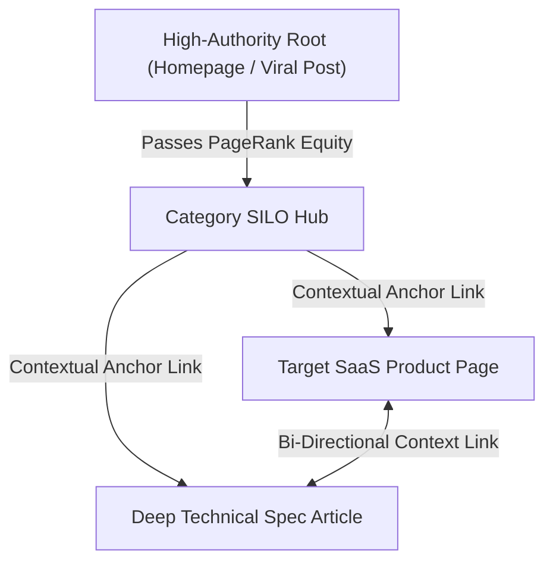

# 🔄 Internal Linking Architecture & PageRank Distribution

> **SEOER.AI Lab Spec // Module 07: First-principles engineering specification for internal linking, PageRank algorithms ($PR(A)$), HITS Hubs & Authorities, contextual anchor text optimization, and automated internal link engines.**

---

## 📌 Executive Summary

**Internal Linking** is the structural network of hyperlinks connecting URLs on the same domain. Internal links serve as the power grid of your website: they enable search engine crawlers to discover pages, define topical SILO boundaries, and distribute **PageRank** (link equity) across your entire domain.



---

## 1. Mathematical Foundation: The PageRank Equation

Search engines calculate relative page authority using variants of Larry Page's **PageRank algorithm**:

$$PR(A) = \frac{1-d}{N} + d \left( \frac{PR(T_1)}{C(T_1)} + \frac{PR(T_2)}{C(T_2)} + \dots + \frac{PR(T_n)}{C(T_n)} \right)$$

- **$PR(A)$**: PageRank value of target Page $A$.
- **$d$ (Damping Factor)**: Standard value $0.85$ (represents the probability that a random web surfer continues clicking links).
- **$N$**: Total number of pages in the index domain.
- **$C(T_i)$**: Total number of outbound links on page $T_i$.

> **PageRank Link Equity Rule**: Every outbound link on a page dilutes the PageRank passed to each individual recipient. Adding 100 irrelevant footer links reduces the link equity delivered to your core money pages by 90%!

---

## 2. HITS Algorithm: Hubs & Authorities

In addition to PageRank, search engines evaluate pages using Jon Kleinberg's **HITS (Hyperlink-Induced Topic Search)** algorithm:

```text
┌───────────────────────────────────────────────────────────────────────────┐
│                      HITS HUBS & AUTHORITIES MODEL                        │
└───────────────────────────────────────────────────────────────────────────┘
   Hub Pages (Authority = High)       ──► Point to multiple authoritative pages.
   Authority Pages (Hub Score = High) ──► Receive links from multiple hubs.
```

- **Hub Score ($y_p$)**: $y_p = \sum_{q \in p \to q} x_q$ (Sums the authority of all pages linked to by page $p$).
- **Authority Score ($x_p$)**: $x_p = \sum_{q \in q \to p} y_q$ (Sums the hub scores of all pages linking to page $p$).

---

## 3. Automated Contextual Auto-Linker Engine (Go Pattern)

Implement an automated internal link engine that injects contextual internal links into rendered HTML at build time without breaking existing HTML tags:

```go
// Go Auto-Linker Engine Snippet
package main

import (
	"fmt"
	"strings"
)

type LinkRule struct {
	Keyword string
	Target  string
}

func AutoLinkHTML(html string, rules []LinkRule) string {
	for _, rule := range rules {
		// Only replace first unlinked keyword occurrence
		anchor := fmt.Sprintf(`<a href="%s" class="context-link">%s</a>`, rule.Target, rule.Keyword)
		html = strings.Replace(html, rule.Keyword, anchor, 1)
	}
	return html
}
```

---

## 4. Contextual Anchor Text Distribution Matrix

| Anchor Category | Example Syntax | Search Engine Value | Risk Level |
| :--- | :--- | :--- | :--- |
| **Exact Match** | `<a href="/seo/crawl-budget">crawl budget optimization</a>` | ⭐⭐⭐⭐⭐ (Highest) | ✅ Safe internally |
| **Partial Match** | `<a href="/seo/crawl-budget">learn how to optimize crawl budget</a>` | ⭐⭐⭐⭐⭐ (High) | ✅ Safe internally |
| **Branded / URL** | `<a href="/seo/crawl-budget">seoer.ai/crawl-budget</a>` | ⭐⭐⭐ | ✅ Safe internally |
| **Generic (Avoid!)** | `<a href="/seo/crawl-budget">click here</a>` | ⭐ (Zero Value) | ❌ Waste of PageRank |

---

## 5. Summary

Internal linking is pure network topology. By calculating PageRank distribution ($PR(A)$), optimizing HITS Hub & Authority scores, building automated Go contextual auto-linkers, and eliminating generic anchor text, you elevate your entire domain's ranking power.
