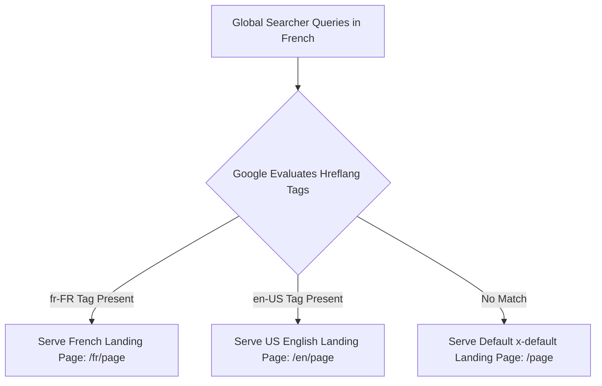

# International SEO: Hreflang Tags & Multi-Region Routing

> **A first-principles guide to International SEO, `hreflang` implementation rules, ccTLDs vs subdomains vs subdirectories, and geo-targeted routing.**

---

## 📌 Executive Summary

**International SEO** is the practice of optimizing your website so that search engines can easily identify which countries you target and which languages you serve. When operating multi-language or multi-region applications, implementing **`hreflang` annotations** prevents duplicate content penalties and ensures users see the correct localized version of your page in search results.



---

## 1. Domain Architecture for Global SEO

Choose the right URL structure based on your international expansion goals:

| Architecture Model | Example Structure | SEO Advantages | SEO Disadvantages |
| :--- | :--- | :--- | :--- |
| **ccTLDs** | `site.fr`, `site.de` | Highest local trust & geo-signal. | Expensive; PageRank does NOT pass automatically across domains. |
| **Subdirectories (Recommended)** | `site.com/fr/`, `site.com/de/` | **Consolidates all PageRank link equity on 1 main domain.** Easy setup! | Slightly weaker local trust signal than ccTLD. |
| **Subdomains** | `fr.site.com`, `de.site.com` | Separate server hosting flexibility. | Split PageRank; harder to pass authority across subdomains. |

---

## 2. Hreflang Tag Implementation Syntax

Place `hreflang` link tags in the HTML `<head>` or XML sitemap for every translated page variant:

```html
<!-- On ALL language versions of the page (US, UK, FR, DE, and Default) -->
<link rel="alternate" hreflang="en-us" href="https://seoer.ai/en-us/page" />
<link rel="alternate" hreflang="en-gb" href="https://seoer.ai/en-gb/page" />
<link rel="alternate" hreflang="fr-fr" href="https://seoer.ai/fr-fr/page" />
<link rel="alternate" hreflang="de-de" href="https://seoer.ai/de-de/page" />
<link rel="alternate" hreflang="x-default" href="https://seoer.ai/page" />
```

---

## 3. The 3 Golden Rules of Hreflang

1. **Bi-Directional Reciprocity**: If Page A links to Page B via `hreflang`, Page B **MUST** link back to Page A via `hreflang`. If links are not 100% reciprocal, search engines ignore the annotations!
2. **Self-Referencing Tag**: Every page MUST include an `hreflang` tag pointing back to itself.
3. **The `x-default` Fallback**: Always include `hreflang="x-default"` to specify the fallback URL for users whose language/country is not explicitly targeted.

---

## 4. IP Geolocation Auto-Redirection Warnings

> [!CAUTION]
> **Avoid Hard IP Auto-Redirects**
> Automatically redirecting users (or Googlebot) based on their IP address without choice breaks search engine indexing! Googlebot crawls primarily from US IP addresses; hard-redirecting US IPs away from foreign language pages prevents those foreign pages from being indexed.

- **Best Practice**: Use subtle top banner notifications (*"Looking for the French site? Switch to /fr"*), leaving the URL crawlable for Googlebot.

---

## 5. Summary

International SEO ensures your software reaches a global audience. By organizing multi-language pages into clean subdirectories (`/fr/`), enforcing reciprocal `hreflang` tags, and avoiding forced IP redirects, you capture global search demand.
