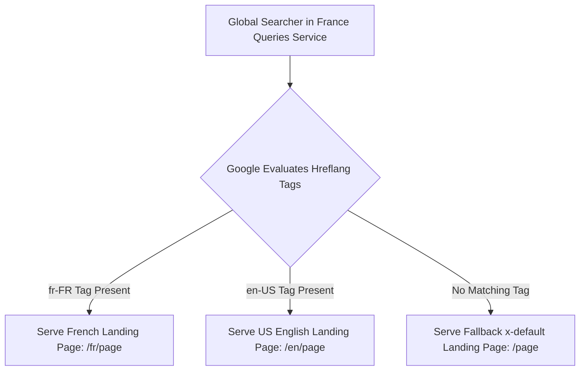

# 🌍 International SEO & Hreflang Engineering

> **SEOER.AI Lab Spec // Module 14: First-principles engineering specification for global SEO, bi-directional `hreflang` tag verification, subdirectories vs ccTLDs, and geo-targeted routing.**

---

## 📌 Executive Summary

**International SEO** optimizes web applications so that search engines accurately determine which countries and languages you target. When operating multi-language or multi-region applications, deploying **`hreflang` annotations** prevents duplicate content penalties and guarantees search engines serve the correct localized page version to users based on their native language and region.



---

## 1. Domain Architecture Model Comparison

Select the optimal URL structure for global scaling based on technical and PageRank trade-offs:

| Domain Architecture | Example URL Structure | PageRank Equity Transfer | Local Trust Signal | Maintenance Overhead |
| :--- | :--- | :--- | :--- | :--- |
| **ccTLDs** | `site.fr`, `site.de` | ❌ Split across domains | ⭐⭐⭐⭐⭐ (Highest) | ⚠️ High (Multiple domains) |
| **Subdirectories (Recommended)** | `site.com/fr/`, `site.com/de/` | ⭐⭐⭐⭐⭐ (**100% Consolidated**) | ⭐⭐⭐⭐ | ✅ **Low (Single domain)** |
| **Subdomains** | `fr.site.com`, `de.site.com` | ⚠️ Partial transfer | ⭐⭐⭐ | ⚠️ Moderate |

---

## 2. Hreflang Annotation Syntax & Golden Rules

Place `hreflang` link annotations in the HTML `<head>` or XML sitemap for every translated page variant:

```html
<!-- On ALL language versions of the page (US, UK, FR, DE, and Fallback) -->
<link rel="alternate" hreflang="en-us" href="https://seoer.ai/en-us/page" />
<link rel="alternate" hreflang="en-gb" href="https://seoer.ai/en-gb/page" />
<link rel="alternate" hreflang="fr-fr" href="https://seoer.ai/fr-fr/page" />
<link rel="alternate" hreflang="de-de" href="https://seoer.ai/de-de/page" />
<link rel="alternate" hreflang="x-default" href="https://seoer.ai/page" />
```

### The 3 Golden Rules of Hreflang Verification
1. **Bi-Directional Reciprocity**: If Page A links to Page B via `hreflang`, Page B **MUST** link back to Page A via `hreflang`. Unidirectional links are ignored by Googlebot!
2. **Self-Referencing Tag**: Every page MUST include an `hreflang` tag pointing directly to itself.
3. **The `x-default` Fallback**: Always specify `hreflang="x-default"` to catch users whose language/region is not explicitly targeted.

---

## 3. IP Geolocation Redirection Warnings

> [!CAUTION]
> **Do NOT Force IP Auto-Redirects on Crawlers**
> Automatically redirecting users (or Googlebot) based on IP address breaks search engine indexing! Googlebot crawls primarily from US IP addresses; hard-redirecting US IPs away from foreign language pages prevents those pages from ever being indexed.

- **Recommended Approach**: Display a non-intrusive top banner (*"Looking for the French site? Switch to /fr"*), leaving the page crawlable for search engines.

---

## 4. Summary

International SEO expands your software's global reach. By consolidating domain PageRank into clean subdirectories (`/fr/`), enforcing reciprocal `hreflang` tags, and avoiding forced IP redirects, you capture international search demand safely.
