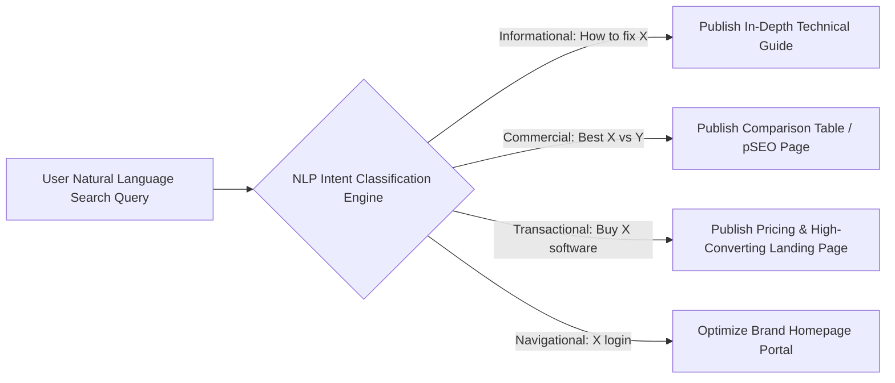

# 🎯 Keyword Research & Search Intent Engine Architecture

> **SEOER.AI Lab Spec // Module 17: First-principles engineering specification for keyword research, search intent classification (Informational, Commercial, Navigational, Transactional), Zipfian long-tail distribution math, and GSC opportunity mining.**

---

## 📌 Executive Summary

**Keyword Research** is the discovery, classification, and structural mapping of search queries typed into search engines. Success in modern search engineering requires moving beyond raw monthly volume metrics to accurately classify **Search Intent** and target queries matching your domain's topical authority.



---

## 1. Mathematical Foundation: Zipfian Power-Law Search Distribution

Search query volume across any industry follows a **Zipfian Power-Law Distribution**:

$$P(k) = \frac{1 / k^s}{\sum_{n=1}^{N} (1 / n^s)}$$

- $k$: Keyword frequency rank.
- $s$: Value exponent (typically $s \approx 1$).
- **Key Insight**: While 20% of search volume belongs to hyper-competitive Head Keywords (*"SEO"*), **80% of total search volume and 90% of conversions belong to Long-Tail Queries** (*"best programmatic SEO engine for Go"*).

```text
┌───────────────────────────────────────────────────────────────────────────┐
│                      ZIPFIAN SEARCH QUERY DISTRIBUTION                    │
└───────────────────────────────────────────────────────────────────────────┘
   Head Keywords (20% Volume, High Competition) ──► "SEO" (Hard to Rank!)
   Body Keywords (30% Volume, Med Competition)  ──► "Technical SEO Guide"
   Long-Tail     (50% Volume, High Conversion)  ──► "Go SSR SEO Benchmark 2026" (Easy!)
```

---

## 2. Intent Classification Engine Matrix

| Intent Category | User Mindset | Target Keyword Signals | Target Component Page | Conversion Rate |
| :--- | :--- | :--- | :--- | :--- |
| **Informational** | Learning a technical concept. | *"How to"*, *"What is"*, *"Guide"*, *"Examples"* | Tech Article, Documentation | 1% – 3% |
| **Commercial** | Evaluating options before buying. | *"Best"*, *"vs"*, *"Top 10"*, *"Review"*, *"Alternative"* | Comparison Table, pSEO Page | **8% – 18%** |
| **Transactional** | Ready to purchase or sign up now. | *"Buy"*, *"Pricing"*, *"Discount"*, *"Sign up"* | Pricing Page, Landing Page | **15% – 35%+** |
| **Navigational** | Searching for specific brand portal. | *"seoer.ai login"*, *"Kitwork docs"* | Brand Homepage | N/A (Direct) |

---

## 3. GSC Opportunity Keyword Mining Algorithm (Go Pattern)

Mine your Google Search Console telemetry data for "striking distance" keywords (Position #8–#15) that can be easily pushed into the Top 3:

```go
// Go GSC Opportunity Keyword Mining Engine
package main

import "fmt"

type KeywordOpportunity struct {
	Query       string
	Impressions int
	Clicks      int
	Position    float64
	CTR         float64
}

func IdentifyStrikingDistanceKeywords(items []KeywordOpportunity) []KeywordOpportunity {
	var opportunities []KeywordOpportunity
	for _, item := range items {
		// Filter for high-impression keywords ranking in Position 8.0 - 15.0
		if item.Position >= 8.0 && item.Position <= 15.0 && item.Impressions > 500 {
			opportunities = append(opportunities, item)
		}
	}
	return opportunities
}
```

---

## 4. Summary

Targeting search intent is 80% of keyword strategy. By focusing on high-intent Commercial and Transactional long-tail queries ($P(k)$ distribution), software builders capture high-converting users without competing against multi-billion dollar incumbents for broad head terms.
