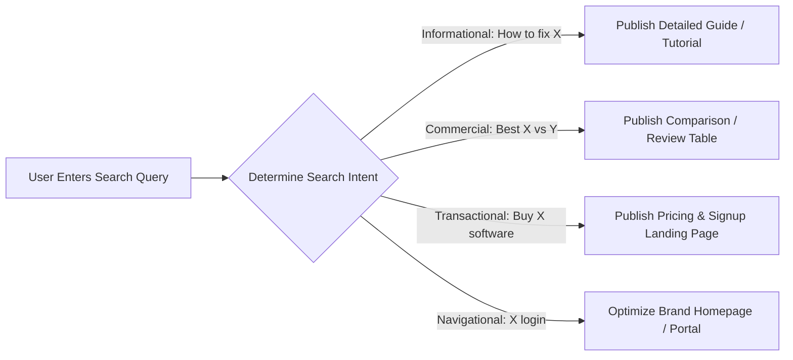

# Keyword Research & Search Intent Architecture

> **A first-principles guide to keyword research, search intent classification (Informational, Commercial, Navigational, Transactional), and difficulty scoring.**

---

## 📌 Executive Summary

**Keyword Research** is the process of discovering, analyzing, and structuring the actual search terms users type into search engines. Success in modern keyword research is not about hunting for high search volume alone—it is about accurately classifying **Search Intent** and selecting keywords matching your domain's topical authority and technical capacity.



---

## 1. The 4 Types of Search Intent

| Intent Category | User Mindset | Keyword Example Signals | Best Target Page Type | Conversion Rate |
| :--- | :--- | :--- | :--- | :--- |
| **Informational** | Wants to learn or understand a concept. | *"How to"*, *"What is"*, *"Guide"*, *"Examples"* | Blog Post, Documentation | 1% – 3% |
| **Commercial** | Comparing options before buying. | *"Best"*, *"vs"*, *"Top 10"*, *"Review"*, *"Alternative"* | Comparison Table, pSEO Page | 5% – 15% |
| **Transactional** | Ready to purchase or sign up now. | *"Buy"*, *"Pricing"*, *"Discount"*, *"Sign up"* | Pricing Page, Landing Page | **15% – 30%+** |
| **Navigational** | Looking for a specific brand or login page. | *"Kitwork docs"*, *"seoer.ai login"* | Brand Homepage | N/A (Direct) |

---

## 2. Long-Tail vs. Head Keywords Matrix

```text
┌───────────────────────────────────────────────────────────────────────────┐
│                      KEYWORD SEARCH SPECTRUM MATRIX                       │
└───────────────────────────────────────────────────────────────────────────┘
   Head Keyword (High Volume, High Competition) ──► "SEO" (Hard to Rank!)
   Body Keyword (Med Volume, Med Competition)   ──► "Technical SEO Guide"
   Long-Tail    (Low Volume, High Conversion)   ──► "Go SSR SEO Framework Benchmark" (Easy!)
```

- **Head Keywords**: Single broad terms (*"SaaS"*). Millions of searches, massive competition, vague intent.
- **Long-Tail Keywords**: Specific multi-word phrases (*"best programmatic SEO tool for Next.js"*). Lower volume, low competition, **hyper-high conversion**.

---

## 3. Finding Low-Hanging Keyword Opportunities

1. **Google Search Console (GSC) Impression Analysis**: Filter GSC for keywords where your page ranks in position #8–#20 with high impressions. Updating content title tags and internal links can jump ranking to position #1–#3.
2. **Reddit & Forum Mining**: Search subreddits (`r/SaaS`, `r/webdev`) for recurring questions that lack high-quality search engine results.
3. **Competitor Content Gap Analysis**: Identify long-tail keywords your competitors rank for but your domain has missed.

---

## 4. Summary

Targeting the right search intent is 80% of SEO success. By focusing on high-intent Commercial and Transactional long-tail queries, software builders capture high-converting users without competing against multi-billion dollar incumbents for broad head terms.
