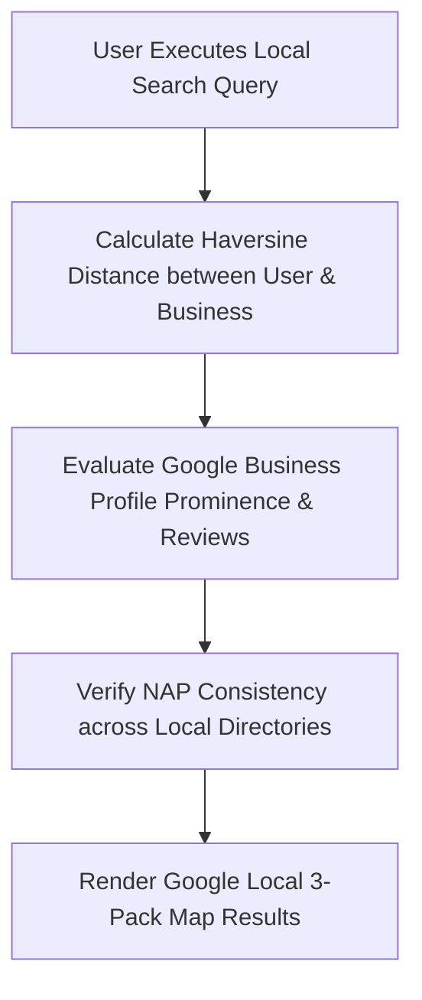

# 📍 Local SEO & Geographic Search Optimization

> **SEOER.AI Lab Spec // Module 12: First-principles engineering specification for local search optimization, Haversine geographic proximity algorithms, NAP consistency verification, and LocalBusiness JSON-LD microdata.**

---

## 📌 Executive Summary

**Local SEO** optimizes web applications to rank for geographically constrained queries (e.g., *"web development agency in Da Nang"*, *"SaaS consultant near me"*). Google evaluates local search using three primary variables: **Relevance**, **Prominence**, and **Geographic Proximity**.



---

## 1. Mathematical Foundation: The Haversine Distance Formula

Google Local algorithms calculate the distance $d$ between the user's GPS/IP coordinates $(\phi_1, \lambda_1)$ and the business location $(\phi_2, \lambda_2)$ using the **Haversine Formula**:

$$a = \sin^2\left(\frac{\Delta \phi}{2}\right) + \cos(\phi_1) \cdot \cos(\phi_2) \cdot \sin^2\left(\frac{\Delta \lambda}{2}\right)$$

$$c = 2 \cdot \text{atan2}\left(\sqrt{a}, \sqrt{1-a}\right), \quad d = R \cdot c$$

- $\phi$: Latitude in radians.
- $\lambda$: Longitude in radians.
- $R$: Earth's radius ($6,371\text{ km}$).
- **Proximity Weight**: Businesses located within $d \le 5\text{ km}$ of the searcher receive a major ranking boost in the Local 3-Pack.

---

## 2. NAP (Name, Address, Phone) String Normalization

Inconsistent phone numbers, address abbreviations, or name variations confuse local search algorithms:

```javascript
// JavaScript NAP Normalization Engine
function normalizeNap(addressString) {
  return addressString
    .toLowerCase()
    .replace(/\bstreet\b/g, 'st')
    .replace(/\broad\b/g, 'rd')
    .replace(/\bavenue\b/g, 'ave')
    .replace(/[^a-z0-9\s]/g, '') // Remove punctuation
    .trim();
}
```

---

## 3. Production LocalBusiness JSON-LD Schema

Embed nested `LocalBusiness` JSON-LD microdata on contact and local landing pages:

```html
<script type="application/ld+json">
{
  "@context": "https://schema.org",
  "@type": "ProfessionalService",
  "@id": "https://seoer.ai/#localbusiness",
  "name": "seoer.ai Search Engineering Lab",
  "url": "https://seoer.ai",
  "telephone": "+84905000000",
  "priceRange": "$$",
  "address": {
    "@type": "PostalAddress",
    "streetAddress": "Da Nang Tech Center",
    "addressLocality": "Da Nang",
    "addressRegion": "Da Nang",
    "postalCode": "550000",
    "addressCountry": "VN"
  },
  "geo": {
    "@type": "GeoCoordinates",
    "latitude": 16.0544,
    "longitude": 108.2022
  },
  "openingHoursSpecification": {
    "@type": "OpeningHoursSpecification",
    "dayOfWeek": ["Monday", "Tuesday", "Wednesday", "Thursday", "Friday"],
    "opens": "09:00",
    "closes": "18:00"
  }
}
</script>
```

---

## 4. Summary

Local SEO captures high-intent geographic customers. By calculating Haversine distance proximity, enforcing normalized NAP consistency across directories, and embedding structured LocalBusiness JSON-LD microdata, you command Google Local 3-Pack map rankings.
