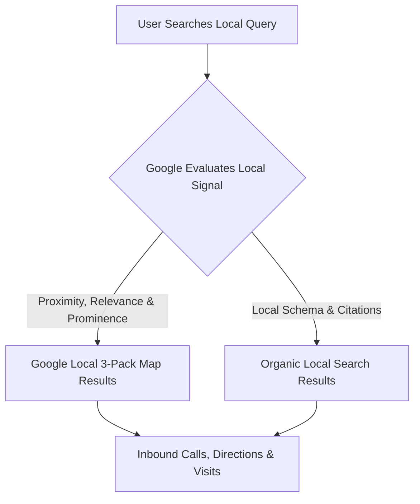

# Local SEO & Google Business Profile Optimization

> **A first-principles guide to local search engine optimization, Google Local 3-Pack rankings, NAP consistency, and local Schema.org microdata.**

---

## 📌 Executive Summary

**Local SEO** is the process of optimizing your online presence to attract local customers from geographically constrained searches (e.g., *"web development agency in Da Nang"*, *"SaaS consultant near me"*). Local SEO centers around Google Business Profile (GBP) optimization, local citation consistency (NAP), and LocalBusiness structured data.



---

## 1. The 3 Local Ranking Factors

Google determines local search rankings based on three core criteria:

1. **Relevance**: How well your local business profile matches what the user is searching for.
2. **Distance (Proximity)**: How far your business location is from the searcher's physical location or geographic query term.
3. **Prominence**: How famous or well-regarded your business is (reviews count, rating score, local backlinks, citations).

---

## 2. NAP Consistency (Name, Address, Phone)

```text
┌───────────────────────────────────────────────────────────────────────────┐
│                       NAP CONSISTENCY AUDIT MATRIX                        │
└───────────────────────────────────────────────────────────────────────────┘
   Google Business Profile ──►  seoer.ai | Da Nang, Vietnam | +84 905 000 000
   Website Footer          ──►  seoer.ai | Da Nang, Vietnam | +84 905 000 000
   Local Directory         ──►  seoer.ai | Da Nang, Vietnam | +84 905 000 000
```

> **The Local Rule**: Your Business Name, Address, and Phone Number (NAP) must be **100% identical** across every directory, website footer, and social profile. Inconsistent phone numbers or address abbreviations confuse local ranking algorithms.

---

## 3. LocalBusiness Schema.org Microdata

Embed `LocalBusiness` JSON-LD microdata on your contact and local landing pages:

```html
<script type="application/ld+json">
{
  "@context": "https://schema.org",
  "@type": "LocalBusiness",
  "name": "seoer.ai",
  "image": "https://seoer.ai/logo.png",
  "address": {
    "@type": "PostalAddress",
    "addressLocality": "Da Nang",
    "addressCountry": "VN"
  },
  "geo": {
    "@type": "GeoCoordinates",
    "latitude": 16.0544,
    "longitude": 108.2022
  },
  "url": "https://seoer.ai",
  "telephone": "+84905000000"
}
</script>
```

---

## 4. Summary

Local SEO captures high-intent geographically targeted customers. By optimizing your Google Business Profile, enforcing strict NAP consistency across directories, and embedding LocalBusiness JSON-LD schema, you dominate local map pack results.
