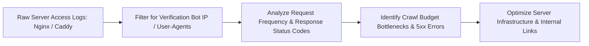

# Server Log File Analysis for Technical SEO

> **A first-principles guide to analyzing web server log files (Nginx, Caddy, Apache), identifying Googlebot user-agent activity, and diagnosing crawl budget bottlenecks.**

---

## 📌 Executive Summary

**Log File Analysis** is the ultimate source of truth in technical SEO. While Google Search Console provides sampled data, raw server logs record **100% of every HTTP request** made by search engine crawlers (Googlebot, Bingbot, PerplexityBot) in real time. Analyzing log files reveals exact crawler hit frequency, HTTP status code distribution, and wasted crawl budget patterns.



---

## 1. Anatomy of a Server Log Entry

```text
# Standard Combined Log Format Entry
66.249.66.1 - - [28/Jul/2026:08:14:22 +0000] "GET /technical-seo HTTP/1.1" 200 14250 "-" "Mozilla/5.0 (compatible; Googlebot/2.1; +http://www.google.com/bot.html)"
```

- **IP Address**: `66.249.66.1` (Reverse DNS verify to confirm legitimate Googlebot).
- **Timestamp**: `[28/Jul/2026:08:14:22 +0000]`.
- **HTTP Method & Path**: `GET /technical-seo HTTP/1.1`.
- **Status Code**: `200` (OK).
- **Bytes Transferred**: `14250` bytes.
- **User-Agent**: `Googlebot/2.1`.

---

## 2. Reverse DNS Googlebot Verification CLI

Spoofed user-agents often fake Googlebot headers to scrape websites. Always verify legitimate Googlebot IPs using reverse DNS lookups:

```bash
# 1. Perform reverse DNS lookup on IP from log
host 66.249.66.1
# Output: 1.66.249.66.in-addr.arpa domain name pointer crawl-66-249-66-1.googlebot.com.

# 2. Verify forward DNS lookup matches
host crawl-66-249-66-1.googlebot.com
# Output: crawl-66-249-66-1.googlebot.com has address 66.249.66.1 (Verified!)
```

---

## 3. Log Analysis CLI Command Toolkit

Analyze server access logs directly via terminal one-liners:

```bash
# Count total Googlebot requests in access log
grep -i "googlebot" access.log | wc -l

# View Top 10 most frequently crawled URLs by Googlebot
grep -i "googlebot" access.log | awk '{print $7}' | sort | uniq -c | sort -nr | head -n 10

# Count HTTP Status Code distribution for Googlebot
grep -i "googlebot" access.log | awk '{print $9}' | sort | uniq -c | sort -nr

# Identify URLs returning 5xx Server Errors to Googlebot
grep -i "googlebot" access.log | awk '$9 ~ /^5/ {print $7}' | sort | uniq -c
```

---

## 4. Summary

Log file analysis exposes how search engines interact with your infrastructure without guessing. By regularly inspecting server access logs via CLI tools, verifying bot IP authenticity, and monitoring status code distributions, you protect your site's search health.
