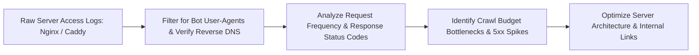

# 📋 Server Log Forensics & Search Bot Analytics

> **SEOER.AI Lab Spec // Module 09: First-principles engineering specification for web server log file analysis (Nginx, Caddy, Apache), Googlebot IP verification, crawl budget anomaly detection, and CLI log parsing.**

---

## 📌 Executive Summary

**Log File Analysis** is the ultimate source of truth in technical SEO. While Google Search Console provides sampled data, raw web server logs record **100% of every HTTP request** made by search crawlers (Googlebot, Bingbot, PerplexityBot) in real time. Analyzing access logs exposes exact crawler hit frequencies, status code distributions, and wasted crawl budget patterns.



---

## 1. Anatomy of Nginx Combined Access Log

```text
# Nginx Combined Log Format Entry
66.249.66.1 - - [28/Jul/2026:08:14:22 +0000] "GET /technical-seo HTTP/1.1" 200 14250 "-" "Mozilla/5.0 (compatible; Googlebot/2.1; +http://www.google.com/bot.html)"
```

- **IP Address**: `66.249.66.1` (Requires Reverse DNS verification to filter out fake crawlers).
- **Timestamp**: `[28/Jul/2026:08:14:22 +0000]`.
- **HTTP Method & Path**: `GET /technical-seo HTTP/1.1`.
- **Status Code**: `200` (OK).
- **Bytes Transferred**: `14250` bytes.
- **User-Agent Header**: `Googlebot/2.1`.

---

## 2. Reverse DNS Googlebot IP Verification in Go

Fake scrapers often spoof Googlebot user-agent strings. Always verify legitimate Googlebot IPs using reverse DNS lookups:

```go
// Go Reverse DNS Googlebot Verifier
package main

import (
	"net"
	"strings"
)

func IsVerifiedGooglebot(ipStr string) bool {
	names, err := net.LookupAddr(ipStr)
	if err != nil || len(names) == 0 {
		return false
	}

	// 1. Check if reverse DNS ends with .googlebot.com or .google.com
	hostName := strings.TrimSuffix(names[0], ".")
	if !strings.HasSuffix(hostName, ".googlebot.com") && !strings.HasSuffix(hostName, ".google.com") {
		return false
	}

	// 2. Perform forward DNS lookup to verify IP match
	addrs, err := net.LookupHost(hostName)
	if err != nil {
		return false
	}

	for _, addr := range addrs {
		if addr == ipStr {
			return true // Fully Verified Authentic Googlebot!
		}
	}
	return false
}
```

---

## 3. High-Speed Terminal Log Parsing One-Liners

```bash
# 1. Total Googlebot hits in access log
grep -i "googlebot" /var/log/nginx/access.log | wc -l

# 2. Top 10 most frequently crawled URLs by Googlebot
grep -i "googlebot" /var/log/nginx/access.log | awk '{print $7}' | sort | uniq -c | sort -nr | head -n 10

# 3. HTTP Status Code distribution for Googlebot
grep -i "googlebot" /var/log/nginx/access.log | awk '{print $9}' | sort | uniq -c | sort -nr

# 4. Extract URLs returning 5xx Server Errors to Googlebot
grep -i "googlebot" /var/log/nginx/access.log | awk '$9 ~ /^5/ {print $7, $9}' | sort | uniq -c
```

---

## 4. Summary

Log file analysis exposes how search engines interact with your infrastructure without guessing. By regularly inspecting server access logs via CLI tools, verifying bot IP authenticity in Go, and monitoring status code distributions, you protect your site's search health.
