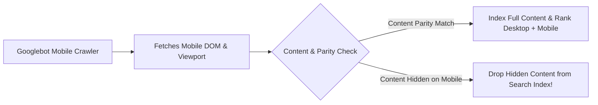

# Mobile SEO & Mobile-First Indexing Architecture

> **A first-principles guide to mobile-first indexing, responsive design optimization, touch target accessibility, and mobile viewport performance.**

---

## 📌 Executive Summary

Google operates exclusively on **Mobile-First Indexing**. This means Googlebot crawls and evaluates your website using its mobile Smartphone crawler (Googlebot Mobile) as the primary baseline for indexing and ranking desktop and mobile results alike. If content or structured data is hidden or missing on mobile views, it is effectively invisible to Google.



---

## 1. The Mobile Parity Checklist

Ensure complete parity between your mobile and desktop versions:

```text
┌───────────────────────────────────────────────────────────────────────────┐
│                      MOBILE CONTENT PARITY CHECKLIST                      │
└───────────────────────────────────────────────────────────────────────────┘
   [ ] 1. Text Content Parity:       Ensure no text is hidden behind "Read More" accordions.
   [ ] 2. Structured Data Parity:   Ensure JSON-LD microdata exists on mobile HTML.
   [ ] 3. Meta Tags Parity:          Ensure Title, Meta Description, & Robots tags match.
   [ ] 4. Image & Video Parity:      Ensure high-res images & video embeds render on mobile.
```

---

## 2. Responsive Viewport & Touch Target Optimization

### A. Meta Viewport Tag Syntax
Every mobile-friendly web page MUST include a valid viewport meta tag:
```html
<meta name="viewport" content="width=device-width, initial-scale=1.0, maximum-scale=5.0">
```

### B. Touch Target Accessibility
Ensure clickable buttons, navigation links, and form inputs have a minimum interactive size of **48x48 CSS pixels** with at least 8px of padding between adjacent links to prevent accidental user clicks.

---

## 3. Avoiding Common Mobile SEO Errors

1. **Unplayable Media**: Using legacy media formats unsupported on mobile browsers (e.g., Flash or non-standard video codecs).
2. **Intrusive Interstitials / Popups**: Displaying full-screen modal popups on mobile entry. Google explicitly penalizes sites with intrusive mobile interstitials that block main content.
3. **Small Font Sizes**: Setting base typography below `16px`, forcing mobile users to pinch-to-zoom.

---

## 4. Summary

Mobile SEO is non-negotiable. By maintaining strict mobile/desktop content parity, using responsive viewports, ensuring 48px touch targets, and eliminating intrusive mobile popups, you pass Google's mobile-first indexing requirements.
