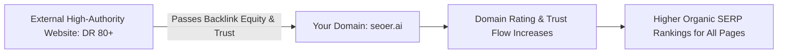

# Off-Page SEO & Backlink Acquisition: Digital PR & Domain Rating

> **A first-principles guide to off-page SEO, backlink acquisition tactics, Domain Rating (DR/DA), Digital PR, and toxic link disavowal.**

---

## 📌 Executive Summary

**Off-Page SEO** refers to optimization actions taken outside of your own website to impact your rankings within search engine results pages. The primary currency of off-page SEO is **Backlinks** (inbound hyperlinks from external domains). Search engines treat high-quality external backlinks as third-party votes of confidence in your domain's credibility and authority.



---

## 1. Quality Over Quantity: The Backlink Evaluation Framework

Not all backlinks are created equal. A single backlink from a reputable, high-DR domain (e.g., GitHub, TechCrunch, W3C) is worth more than 1,000 low-quality forum spam links.

```text
┌───────────────────────────────────────────────────────────────────────────┐
│                      THE BACKLINK QUALITY SCORECARD                       │
└───────────────────────────────────────────────────────────────────────────┘
   1. Domain Authority / DR:   Is the linking site trusted (DR 50+)?
   2. Topical Relevance:       Is the linking site in the same industry/niche?
   3. Link Placement:          Is the link inside editorial body text vs footer/sidebar?
   4. Follow vs Nofollow:      Is it a standard dofollow link passing link equity?
```

---

## 2. 4 High-Impact Indie Backlink Acquisition Strategies

### Strategy 1: Engineering-as-Marketing (Free Tools)
Build a useful, free standalone tool (e.g., SVG generator, JSON-LD Schema validator, free calculator). Free tools naturally attract organic blog mentions, dev bookmark lists, and high-DR editorial backlinks.

### Strategy 2: Original Data & Benchmark Reports
Publish original industry data, speed benchmarks, or survey results. Tech journalists and bloggers link to original data sources when writing articles.

### Strategy 3: Unlinked Brand Mention Reclamation
Set up Google Alerts for your brand name (`"seoer.ai"` or `"Kitwork"`). Reach out to authors who mentioned your product without a link and politely ask them to turn the mention into a clickable hyperlink.

### Strategy 4: High-DR Startup Directories
Submit your product to established startup directories:
- **Product Hunt** (DR 90+)
- **AlternativeTo** (DR 80+)
- **SaaSHub** (DR 70+)
- **GitHub Awesome Lists** (DR 90+)

---

## 3. Handling Toxic Links & The Disavow Tool

```text
┌───────────────────────────────────────────────────────────────────────────┐
│                       DISAVOW FILE SYNTAX (disavow.txt)                   │
└───────────────────────────────────────────────────────────────────────────┘
   # Disavow spammy domain network
   domain:spammysite.xyz
   domain:pbn-network.info
```

If your domain suffers negative SEO attacks or accumulated legacy spam links, submit a `disavow.txt` file through Google Search Console to instruct Googlebot to ignore those specific links.

---

## 4. Summary

Off-Page SEO builds domain trust and authority. By shipping free engineering tools, publishing original data reports, reclaiming unlinked brand mentions, and keeping your link profile clean, you earn high-authority backlinks that elevate your entire domain.
