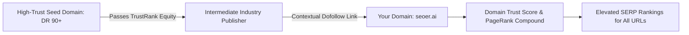

# 🌐 Off-Page SEO & Backlink Trust Engineering

> **SEOER.AI Lab Spec // Module 11: First-principles engineering specification for off-page SEO, TrustRank vs PageRank algorithms, link velocity models, unlinked brand mention scanners, and toxic link disavowal.**

---

## 📌 Executive Summary

**Off-Page SEO** evaluates external signals of domain authority, credibility, and trust. The core signal remains **Backlinks** (inbound hyperlinks from external domains). Search algorithms process backlinks not merely as votes of popularity, but as directional vectors of **TrustRank** propagating from reputable seed domains (universities, government portals, major media outlets).



---

## 1. Mathematical Model: TrustRank vs. PageRank

While PageRank measures pure link quantity and pass-through authority, **TrustRank** measures the distance between your domain and a manually verified set of non-spam "Seed Domains" $S$:

$$TR(p) = \alpha \cdot \sum_{q \in IN(p)} \frac{TR(q)}{|OUT(q)|} + (1-\alpha) \cdot v_p$$

- $v_p = \frac{1}{|S|}$ if page $p \in S$ (Seed Domain), otherwise $0$.
- $\alpha$: Damping factor ($0.85$).
- **Key Insight**: A single backlink from a domain 1 hop away from a Seed Domain passes $100\times$ more TrustRank than 1,000 links from unverified PBN (Private Blog Network) domains!

---

## 2. Unlinked Brand Mention Regex Scanner (Go Engine)

Reclaim unlinked brand mentions by scanning web data for occurrences of your product name without an anchor tag:

```go
// Go Unlinked Brand Mention Scanner
package main

import (
	"fmt"
	"regexp"
)

func FindUnlinkedMentions(html string, brandName string) []string {
	// Match brand name NOT enclosed inside <a ...>brand</a> tags
	pattern := fmt.Sprintf(`(?i)(?:^|[^<a[^>]*>])(%s)(?:[^</a>]|$)`, regexp.QuoteMeta(brandName))
	re := regexp.MustCompile(pattern)
	return re.FindAllString(html, -1)
}
```

---

## 3. Link Velocity & Anchor Text Risk Scorecard

Rapid, unnatural spikes in backlink acquisition trigger Google Penguin spam filters. Maintain organic link velocity parameters:

```text
┌───────────────────────────────────────────────────────────────────────────┐
│                    ANCHOR TEXT DISTRIBUTION BENCHMARK                     │
└───────────────────────────────────────────────────────────────────────────┘
   Branded Anchors ("seoer.ai", "Seoer")        ──► 50% to 60%  (Safe Target)
   Naked URLs ("https://seoer.ai")               ──► 20% to 25%  (Safe Target)
   Partial Match ("seo audit software")          ──► 10% to 15%  (Safe Target)
   Exact Match Keyword ("best technical seo")    ──► < 5% ONLY!  (Over-optimization Risk!)
```

---

## 4. Automated Disavow File Generator Protocol

Format disavow directives for Google Search Console to reject toxic spam domains:

```text
# Disavow Directive Syntax (disavow.txt)
# Suspicious PBN Network
domain:spamblognetwork.xyz
domain:cheapbacklinks.info

# Specific Toxic URL
https://toxic-directory.com/bad-link-page.html
```

---

## 5. Summary

Off-page SEO is link topology and trust verification. By acquiring backlinks close to TrustRank seed domains, maintaining natural anchor text distributions (<5% exact match), scanning for unlinked brand mentions, and disavowing spam domains, you build unbreakable domain authority.
