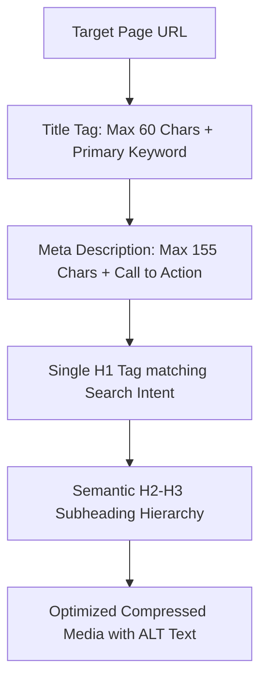

# 📝 On-Page SEO Optimization & HTML Semantic Spec

> **SEOER.AI Lab Spec // Module 18: First-principles engineering specification for on-page optimization, HTML heading hierarchy (H1-H6), high-CTR title tag formulas, meta descriptions, and image ALT attributes.**

---

## 📌 Executive Summary

**On-Page SEO** is the optimization of HTML element structures and visible text content on individual web pages. While technical SEO guarantees crawlability, On-Page SEO ensures search algorithms and LLM parsers precisely understand the relevance, context, and intent of specific pages.



---

## 1. High-CTR Title Tag Engineering Formulas

Title tags (`<title>`) are a primary search ranking signal and directly dictate your Click-Through Rate (CTR) in search results.

```text
┌───────────────────────────────────────────────────────────────────────────┐
│                       TITLE TAG SIZE & FORMAT SPEC                        │
└───────────────────────────────────────────────────────────────────────────┘
   Maximum Pixel Width: 580px (~55 to 60 Characters).
   Formula 1:           [Primary Keyword] – [Actionable Value] | [Brand Name]
   Formula 2:           [Primary Keyword] in [Year]: [Outcome] | [Brand Name]
```

### Title Tag Examples
- *Sub-Optimal*: `SEO Guide - My Website`
- *Engineered*: `Technical SEO Guide: 100 PageSpeed & Crawl Budget | seoer.ai`
- *Engineered*: `10 Best Stripe Alternatives for SaaS in 2026 | seoer.ai`

---

## 2. Semantic Heading Hierarchy (H1 – H6)

Structure content using logical, nested semantic HTML heading tags:

```html
<!-- Single H1 Title per Page -->
<h1>Technical SEO Architecture Specification</h1>

  <h2>1. Crawl Mechanics</h2>
    <h3>1.1 Googlebot User-Agents</h3>
    <h3>1.2 Crawl Budget Formulas</h3>

  <h2>2. Indexing Directives</h2>
    <h3>2.1 Meta Robots Tags</h3>
```

- **Rule 1**: Include exactly **one `<h1>` tag** per page.
- **Rule 2**: Include the primary keyword naturally in your `<h1>` and at least two `<h2>` subheadings.
- **Rule 3**: Never skip heading levels (e.g., do not jump directly from `<h1>` to `<h3>`).

---

## 3. High-Converting Meta Description Spec

- **Length Constraint**: Keep between **120 and 155 characters** (or 920 pixels on desktop).
- **Structure**: Combine a concise summary of page value with an explicit Call-To-Action (CTA) (*"Learn how to..."*, *"Get free checklist..."*).

---

## 4. Responsive Image & ALT Attribute Specification

```html
<!-- SEOER.AI Responsive Image Component Markup -->
<picture>
  <source srcset="/hero.avif" type="image/avif">
  <source srcset="/hero.webp" type="image/webp">
  
</picture>
```

- **ALT Text**: Write concise, descriptive text explaining image context for accessibility screen readers and image search algorithms.

---

## 5. Summary

On-page SEO aligns your HTML element structure with search intent. By crafting 60-character title tags, maintaining strict H1-H3 heading hierarchies, and optimizing responsive image ALT attributes, you maximize organic click-through rates.
