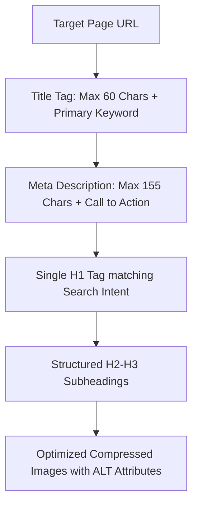

# On-Page SEO Playbook: Title Formulas, Headings & Meta Optimization

> **A first-principles guide to on-page optimization, HTML heading hierarchy (H1-H6), high-CTR title tag formulas, meta descriptions, and image ALT optimization.**

---

## 📌 Executive Summary

**On-Page SEO** refers to optimizing individual web page elements—both visible content and HTML source code—to rank higher in search engines. While technical SEO ensures your site can be crawled, On-Page SEO ensures search algorithms understand the exact relevance and context of each specific page.



---

## 1. High-CTR Title Tag Formulas

Title tags (`<title>`) remain one of the strongest on-page ranking signals and directly determine your click-through rate (CTR) in search results.

```text
┌───────────────────────────────────────────────────────────────────────────┐
│                       TITLE TAG SIZE & FORMAT RULES                       │
└───────────────────────────────────────────────────────────────────────────┘
   Maximum Length: 55 to 60 characters (or 580 pixels).
   Formula 1:      [Primary Keyword] – [Secondary Benefit] | [Brand Name]
   Formula 2:      [Primary Keyword] in [Year]: [Actionable Outcome] | [Brand]
```

### Examples of High-Converting Title Tags
- *Bad*: `SEO Guide - My Website`
- *Good*: `Technical SEO Guide: 100 PageSpeed & Crawl Budget | seoer.ai`
- *Good*: `10 Best Stripe Alternatives for SaaS in 2026 | seoer.ai`

---

## 2. HTML Heading Hierarchy (H1 – H6)

Structure content using logical, nested semantic HTML heading tags.

```html
<h1>Main Topic: Technical SEO Architecture (1 Per Page Only!)</h1>
  <h2>Section 1: Crawl Mechanics</h2>
    <h3>Subsection 1.1: Googlebot User-Agents</h3>
    <h3>Subsection 1.2: Crawl Budget Formulas</h3>
  <h2>Section 2: Indexing Directives</h2>
    <h3>Subsection 2.1: Meta Robots Tags</h3>
```

- **Rule 1**: Use exactly **one `<h1>` tag** per page.
- **Rule 2**: Include the primary keyword naturally in your `<h1>` and at least two `<h2>` headings.
- **Rule 3**: Never skip heading levels (e.g., do not jump directly from `<h1>` to `<h3>`).

---

## 3. Meta Description Best Practices

While meta descriptions are not a direct ranking factor, they function as your ad copy in search engine results pages (SERPs).

- **Length**: Keep between **120 and 155 characters** (or 920 pixels on desktop).
- **Structure**: Combine a clear summary of the page value with an explicit Call-To-Action (CTA) (*"Learn how to..."*, *"Get free checklist..."*).

---

## 4. Image ALT Text & Asset Optimization

```html
<!-- Correct Image Optimization Syntax -->

```

- **ALT Text**: Write concise, descriptive text explaining what the image displays for accessibility screen readers and image search algorithms. Avoid keyword stuffing!

---

## 5. Summary

On-page SEO aligns your HTML structure with user intent. By crafting compelling 60-character title tags, maintaining strict H1-H3 heading hierarchies, and optimizing image ALT attributes, you maximize relevance and click-through rates.
