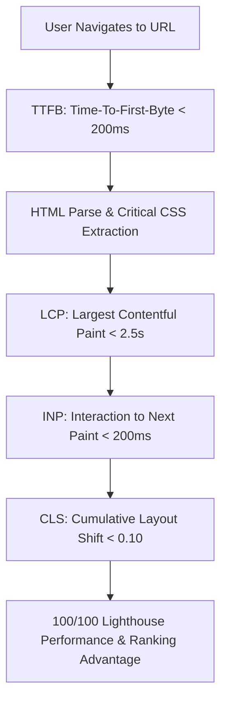
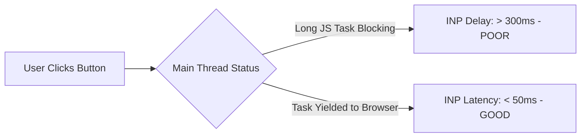

# 🚀 Page Speed & Core Web Vitals (CWV) Engineering Spec

> **SEOER.AI Lab Spec // Module 06: First-principles engineering specification for Core Web Vitals (LCP, INP, CLS), Chromium rendering pipelines, main-thread execution yielding, and sub-second rendering performance.**

---

## 📌 Executive Summary

**Core Web Vitals (CWV)** are a set of real-world performance metrics defined by Google and measured via Chrome User Experience Reports (CrUX). Google uses Core Web Vitals as an explicit search ranking factor. Achieving 100 PageSpeed scores requires understanding how the Chromium rendering engine (Blink) processes HTML, executes JavaScript, calculates layout layouts, and rasterizes GPU pixels.



---

## 1. Mathematical Scoring: Cumulative Layout Shift (CLS)

**Cumulative Layout Shift (CLS)** measures unexpected visual movement during page rendering. Chromium calculates CLS using the Layout Instability API formula:

$$\text{CLS} = \text{Impact Fraction} \times \text{Distance Fraction}$$

- **Impact Fraction**: The area of the viewport affected by unstable elements (e.g., $0.50$ of viewport height).
- **Distance Fraction**: The distance unstable elements moved relative to the viewport (e.g., $0.15$ of viewport height).

$$\text{CLS} = 0.50 \times 0.15 = 0.075 \quad (\text{PASS: } \le 0.10)$$

### Eliminating CLS Shift
Set explicit `aspect-ratio` or `width`/`height` attributes on all images, ads, and dynamic containers to reserve layout geometry before media loads:

```html
<!-- Native CSS Aspect-Ratio Reservation (Zero CLS) -->

```

---

## 2. Largest Contentful Paint (LCP) Sub-Part Breakdown

LCP measures when the main hero content becomes visible. Optimize all 4 sub-components of LCP:

$$\text{LCP Time} = \text{TTFB} + \text{Resource Load Delay} + \text{Resource Load Time} + \text{Element Render Delay}$$

```text
┌───────────────────────────────────────────────────────────────────────────┐
│                       LCP SUB-COMPONENT TARGET BENCHMARKS                 │
└───────────────────────────────────────────────────────────────────────────┘
   1. TTFB (Server Response)   ──► Target: < 200ms  (Edge CDN & Memory Cache)
   2. Resource Load Delay      ──► Target: < 100ms  (Preload & fetchpriority="high")
   3. Resource Load Duration   ──► Target: < 1000ms (AVIF/WebP Format @ 80% Quality)
   4. Element Render Delay     ──► Target: < 100ms  (Zero render-blocking JS/CSS)
```

### Preloading Hero Images with High Fetch Priority
```html
<link rel="preload" fetchpriority="high" as="image" href="/hero.avif" type="image/avif">
```

---

## 3. Interaction to Next Paint (INP) & Main-Thread Yielding

**INP** measures the latency of every user tap, click, or keyboard interaction during the entire page lifecycle. Long JavaScript tasks (>50ms) block the Chromium main thread, causing high INP latency.



### Modern Thread Yielding using `scheduler.yield()`
Break up heavy computation loops using the native `scheduler.yield()` or `requestIdleCallback()` APIs:

```javascript
// Modern INP Thread Yielding Pattern
async function processHeavyData(items) {
  for (let i = 0; i < items.length; i++) {
    doChunkWork(items[i]);

    // Yield control back to main thread every 50 items
    if (i % 50 === 0 && 'scheduler' in window && 'yield' in scheduler) {
      await scheduler.yield();
    }
  }
}
```

---

## 4. Chromium Pipeline & GPU Rasterization

To maintain 60 FPS scrolling and low latency, move animations off the CPU Main Thread onto the GPU Compositor Thread:

```css
/* Performant GPU-Accelerated Animation (Compositor Only) */
.card-hover {
  will-change: transform, opacity;
  transition: transform 200ms ease, opacity 200ms ease;
}

.card-hover:hover {
  transform: translateY(-4px); /* Does NOT trigger CPU Relayout or Repaint! */
}
```

---

## 5. Summary

Core Web Vitals optimization is computer science applied to the browser rendering loop. By reserving layout geometry for CLS $\le 0.10$, preloading LCP assets for sub-second render times, and yielding main-thread execution using `scheduler.yield()`, you guarantee 100 PageSpeed scores and top Google search rankings.
