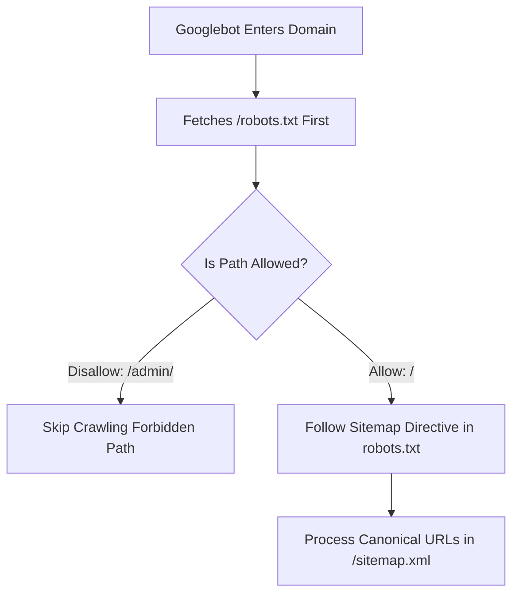

# 🤖 Robots.txt & XML Sitemap Engineering Specs

> **SEOER.AI Lab Spec // Module 16: First-principles engineering specification for `robots.txt` syntax, XML sitemap indexing protocols, news/image sitemaps, and search engine ping APIs.**

---

## 📌 Executive Summary

`robots.txt` and XML Sitemaps are the foundational navigational instructions given to search engine crawlers. **`robots.txt`** defines where crawlers are forbidden to enter, while **XML Sitemaps** provide a clean roadmap of all high-priority canonical URLs you explicitly want indexed.



---

## 1. Production Robots.txt Syntax & Master Template

Place `robots.txt` at the root directory of your domain (`https://seoer.ai/robots.txt`):

```text
# Master Production Robots.txt Specification
User-agent: *
Allow: /

# Block Admin & Internal API Endpoints
Disallow: /admin/
Disallow: /api/private/
Disallow: /*?*sort=

# Allow Verified AI Search Engine Bots
User-agent: PerplexityBot
Allow: /

User-agent: OAI-SearchBot
Allow: /

# XML Sitemap Pointer
Sitemap: https://seoer.ai/sitemap.xml
```

---

## 2. Valid XML Sitemap Specification

An XML sitemap must strictly adhere to the official Sitemaps.org protocol:

```xml
<?xml version="1.0" encoding="UTF-8"?>
<urlset xmlns="http://www.sitemaps.org/schemas/sitemap/0.9">
  <url>
    <loc>https://seoer.ai/technical-seo</loc>
    <lastmod>2026-07-28T08:00:00Z</lastmod>
    <changefreq>weekly</changefreq>
    <priority>0.8</priority>
  </url>
</urlset>
```

### Sitemap Engineering Rules
- **Maximum Limits**: A single sitemap file cannot exceed **50,000 URLs** or **50MB (uncompressed)**.
- **Canonical URLs Only**: Include **ONLY HTTP 200 OK canonical URLs**. Never list redirected (301) or non-indexable (noindex/404) URLs.

---

## 3. Summary

`robots.txt` and XML Sitemaps guide search crawlers through your software efficiently. By defining clear crawl permissions and publishing clean, canonical-only XML sitemaps, you streamline the discovery and indexation of your application.
