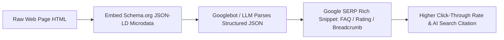

# Schema Markup & Structured Data: JSON-LD & Rich Snippets

> **A first-principles engineering guide to Schema.org structured data, JSON-LD microdata implementation, Knowledge Graphs, and Google Rich Snippet optimization.**

---

## 📌 Executive Summary

**Structured Data** is a standardized format (Schema.org vocabulary) encoded in **JSON-LD** (JavaScript Object Notation for Linked Data) that explicitly tells search engines what a web page means. Adding structured data enables Google Rich Snippets (star ratings, FAQ accordions, breadcrumbs, pricing, author bios) and provides direct entity knowledge to AI Answer Engines (Perplexity, ChatGPT, SGE).



---

## 1. Why JSON-LD Over Microdata or RDFa

Google explicitly recommends **JSON-LD**. Unlike legacy Microdata (which mixes HTML tags with attributes), JSON-LD is embedded in a clean `<script type="application/ld+json">` tag inside `<head>` or `<body>` without polluting visual presentation HTML.

```json
{
  "@context": "https://schema.org",
  "@type": "SoftwareApplication",
  "name": "Kitwork Runtime",
  "operatingSystem": "Linux, macOS, Windows",
  "applicationCategory": "DeveloperApplication",
  "offers": {
    "@type": "Offer",
    "price": "0",
    "priceCurrency": "USD"
  }
}
```

---

## 2. Essential Schema.org Types for SaaS & Web Applications

### A. SoftwareApplication Schema (For SaaS / Developer Tools)
```html
<script type="application/ld+json">
{
  "@context": "https://schema.org",
  "@type": "SoftwareApplication",
  "name": "seoer.ai",
  "operatingSystem": "Web",
  "applicationCategory": "BusinessApplication",
  "aggregateRating": {
    "@type": "AggregateRating",
    "ratingValue": "4.9",
    "ratingCount": "128"
  }
}
</script>
```

### B. FAQPage Schema (For Rich FAQ Snippets)
```html
<script type="application/ld+json">
{
  "@context": "https://schema.org",
  "@type": "FAQPage",
  "mainEntity": [{
    "@type": "Question",
    "name": "What is Generative Engine Optimization (GEO)?",
    "acceptedAnswer": {
      "@type": "Answer",
      "text": "GEO is the practice of optimizing content to be retrieved and cited by AI answer engines like Perplexity, ChatGPT, and Google SGE."
    }
  }]
}
</script>
```

### C. Article / TechArticle Schema (For Blog & Documentation)
```html
<script type="application/ld+json">
{
  "@context": "https://schema.org",
  "@type": "TechArticle",
  "headline": "Core Web Vitals Optimization Guide",
  "author": {
    "@type": "Person",
    "name": "Huỳnh Nhân Quốc"
  },
  "publisher": {
    "@type": "Organization",
    "name": "seoer.ai"
  }
}
</script>
```

---

## 3. Validating Structured Data

Always test JSON-LD code snippets before deploying to production:
1. **Google Rich Results Test**: Validates eligibility for Google Rich Snippets (`search.google.com/test/rich-results`).
2. **Schema Markup Validator**: Validates generic Schema.org syntax (`validator.schema.org`).

---

## 4. Summary

Structured data bridges human readability and machine comprehension. By implementing JSON-LD for SoftwareApplications, FAQs, TechArticles, and Breadcrumbs, you earn Google Rich Snippets and guarantee visibility across AI search platforms.
