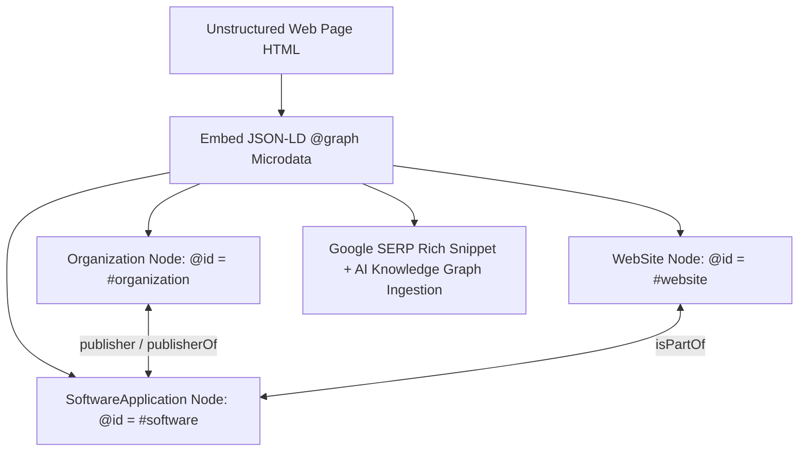

# 📜 Schema.org Microdata & Linked Data (`@graph`) Spec

> **SEOER.AI Lab Spec // Module 05: First-principles engineering specification for Schema.org JSON-LD microdata, nested `@graph` architecture, Wikidata/Wikipedia entity disambiguation (`sameAs`), and AI Knowledge Graph ingestion.**

---

## 📌 Executive Summary

**Structured Data** is a standardized format (Schema.org vocabulary) encoded in **JSON-LD** (JavaScript Object Notation for Linked Data) that explicitly converts unstructured HTML into machine-readable knowledge nodes. Implementing JSON-LD triggers Google Rich Snippets (star ratings, FAQ accordions, breadcrumbs, pricing) and provides unambiguous entity data to AI Answer Engines (Perplexity, SearchGPT, SGE).



---

## 1. Why JSON-LD `@graph` Architecture Superiority

Legacy structured data embeds isolated JSON blocks on a page. Modern microdata engineering uses the **JSON-LD `@graph` architecture** to establish explicit directional relationships between entities on the same page via unique URI references (`@id`).

```json
{
  "@context": "https://schema.org",
  "@graph": [
    {
      "@type": "Organization",
      "@id": "https://seoer.ai/#organization",
      "name": "seoer.ai",
      "url": "https://seoer.ai",
      "logo": "https://seoer.ai/logo.png",
      "sameAs": [
        "https://github.com/seoerai",
        "https://twitter.com/seoerai"
      ]
    },
    {
      "@type": "WebSite",
      "@id": "https://seoer.ai/#website",
      "url": "https://seoer.ai",
      "name": "seoer.ai Search Engineering Lab",
      "publisher": { "@id": "https://seoer.ai/#organization" }
    },
    {
      "@type": "SoftwareApplication",
      "@id": "https://seoer.ai/#software",
      "name": "seoer.ai Audit Engine",
      "operatingSystem": "Linux, macOS, Windows",
      "applicationCategory": "DeveloperApplication",
      "author": { "@id": "https://seoer.ai/#organization" },
      "offers": {
        "@type": "Offer",
        "price": "0",
        "priceCurrency": "USD"
      }
    }
  ]
}
```

---

## 2. Entity Disambiguation via `sameAs` Properties

Eliminate machine ambiguity by linking your entities to authoritative Knowledge Base URIs (Wikidata, Wikipedia, DBpedia, GitHub):

```json
{
  "@type": "TechArticle",
  "headline": "Generative Engine Optimization Engineering Spec",
  "about": [
    {
      "@type": "Thing",
      "name": "Search Engine Optimization",
      "sameAs": "https://www.wikidata.org/wiki/Q180711"
    },
    {
      "@type": "Thing",
      "name": "Large Language Model",
      "sameAs": "https://www.wikidata.org/wiki/Q115305900"
    }
  ]
}
```

---

## 3. Dynamic Head JSON-LD Injection Pattern

In modern single-page applications or SSR frameworks, inject JSON-LD microdata dynamically inside the HTML `<head>`:

```javascript
// Universal Dynamic JSON-LD Head Injector
function injectJsonLd(schemaData) {
  const script = document.createElement('script');
  script.type = 'application/ld+json';
  script.text = JSON.stringify(schemaData);
  document.head.appendChild(script);
}
```

---

## 4. Summary

Structured data bridges human presentation and machine understanding. By deploying nested JSON-LD `@graph` architectures, linking entities to Wikidata via `sameAs`, and validating microdata before production deployment, you earn Google Rich Snippets and guarantee AI Knowledge Graph indexing.
