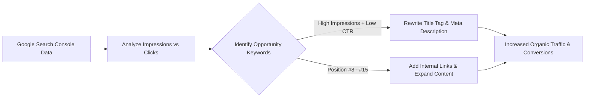

# Google Search Console Analytics & API Diagnostics

> **A first-principles guide to Google Search Console (GSC) performance diagnostics, impression analysis, GSC Search Analytics API integration, and indexation drop recovery.**

---

## 📌 Executive Summary

**Google Search Console (GSC)** is Google's official, zero-cost diagnostic web portal for site owners. Unlike third-party SEO estimation tools, GSC provides 100% authoritative first-party data regarding Googlebot crawl status, indexation coverage, search impressions, clicks, Average Position, and Click-Through Rate (CTR).



---

## 1. Core Metrics & Definitions

1. **Impressions**: The number of times a link to your website was shown in a user's search results page.
2. **Clicks**: The number of times a user clicked a search result link leading to your website.
3. **Click-Through Rate (CTR)**: $\text{CTR \%} = \frac{\text{Clicks}}{\text{Impressions}} \times 100$.
4. **Average Position**: The numerical rank of your URL for a query (1 = top result).

---

## 2. GSC Low-Hanging Fruit Optimization Protocol

Find high-leverage optimization opportunities hiding in your GSC performance data:

```text
┌───────────────────────────────────────────────────────────────────────────┐
│                      GSC LOW-HANGING FRUIT MATRIX                         │
└───────────────────────────────────────────────────────────────────────────┘
   Scenario A: High Impressions + Low CTR (<2%)  ──► Fix Title & Meta Description!
   Scenario B: Ranks Position #8 to #15          ──► Add 3 Contextual Internal Links!
   Scenario C: Sudden Indexation Drop            ──► Check Coverage Report for 5xx/404!
```

---

## 3. Querying GSC Search Analytics API

Automate Search Console reporting via Python or Node.js using the official Google Search Console API:

```javascript
// GSC Search Analytics API Query Example
const res = await searchconsole.searchanalytics.query({
  siteUrl: 'https://seoer.ai/',
  requestBody: {
    startDate: '2026-06-01',
    endDate: '2026-07-28',
    dimensions: ['query', 'page'],
    rowLimit: 50,
  },
});
```

---

## 4. Summary

Google Search Console is your most accurate diagnostic dashboard. By leveraging GSC Search Analytics data to optimize low-CTR pages and jump position #8–#15 keywords into the top 3, you maximize organic traffic growth.
