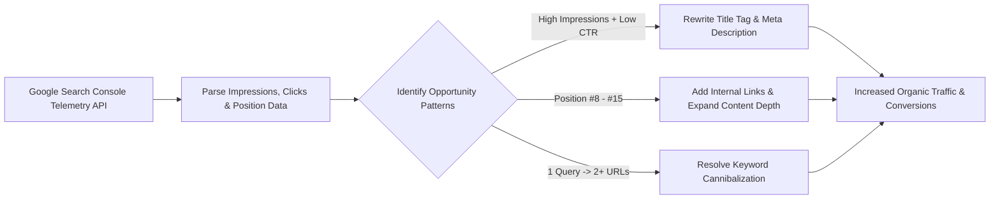

# 📊 Search Console Analytics & Telemetry API

> **SEOER.AI Lab Spec // Module 10: First-principles engineering specification for Google Search Console (GSC) performance diagnostics, CTR decay curve formulas, GSC API integration, and keyword cannibalization detection.**

---

## 📌 Executive Summary

**Google Search Console (GSC)** is the authoritative source for first-party search telemetry data directly from Google's ranking engine. Unlike third-party SEO estimation tools, GSC provides exact metrics on search impressions, user clicks, Click-Through Rates (CTR), and Average Position across all indexable URLs on your domain.



---

## 1. CTR Decay Curve Equation by Search Position

The relationship between SERP Position $P$ and Click-Through Rate ($\text{CTR}$) follows an exponential decay curve:

$$\text{CTR}(P) = \alpha \cdot e^{-\beta \cdot P}$$

```text
┌───────────────────────────────────────────────────────────────────────────┐
│                    SERP POSITION CTR BENCHMARK TABLE                      │
└───────────────────────────────────────────────────────────────────────────┘
   Position #1:  ~28.5% CTR   ██████████████████████████ (Top Winner!)
   Position #2:  ~15.7% CTR   ██████████████
   Position #3:  ~11.0% CTR   ██████████
   Position #4:  ~8.0%  CTR   ███████
   Position #5:  ~6.1%  CTR   █████
   Position #10: ~2.5%  CTR   ██
```

*Key Takeaway*: Moving a URL from **Position #8 (1.8% CTR)** to **Position #2 (15.7% CTR)** yields an **8.7x increase in organic traffic** without creating any new content!

---

## 2. GSC Low-Hanging Fruit Optimization Matrix

| Telemetry Scenario | GSC Metric Signal | Root Cause | Engineering Solution |
| :--- | :--- | :--- | :--- |
| **Low-CTR Opportunity** | High Impressions (>1,000) + Low CTR (<1.5%) | Boring title tag or irrelevant snippet. | Rewrite Title Tag with high-CTR action formula + add FAQ JSON-LD. |
| **Striking Distance** | Average Position #8 to #15 | Page has baseline authority but lacks link equity. | Add 3 contextual internal links from high-PageRank pillar pages. |
| **Keyword Cannibalization** | 1 Search Query splitting clicks across 2 URLs | Google is confused about which page is authoritative. | 301 redirect secondary URL to primary URL or adjust title tags. |

---

## 3. Automated GSC Telemetry Query (Python Pattern)

Automate Search Console data extraction using the official Google Search Console API:

```python
# GSC API Telemetry Collector
from googleapiclient.discovery import build
from google.oauth2.service_account import Credentials

SCOPES = ['https://www.googleapis.com/auth/webmasters.readonly']
creds = Credentials.from_service_account_file('gsc_credentials.json', scopes=SCOPES)
service = build('searchconsole', 'v1', credentials=creds)

request = {
    'startDate': '2026-06-01',
    'endDate': '2026-07-28',
    'dimensions': ['query', 'page'],
    'dimensionFilterGroups': [{
        'filters': [{'dimension': 'position', 'operator': 'greaterThan', 'expression': '7'}]
    }],
    'rowLimit': 100
}

response = service.searchanalytics().query(siteUrl='https://seoer.ai/', body=request).execute()

for row in response.get('rows', []):
    query, page = row['keys'][0], row['keys'][1]
    print(f"Query: {query} | Page: {page} | Pos: {row['position']:.1f} | CTR: {row['ctr']*100:.1f}%")
```

---

## 4. Summary

Google Search Console is your most valuable diagnostic instrument. By evaluating CTR decay curve math, leveraging GSC API scripts to spot striking-distance keywords (Position #8–#15), and eliminating keyword cannibalization, you accelerate organic growth.
