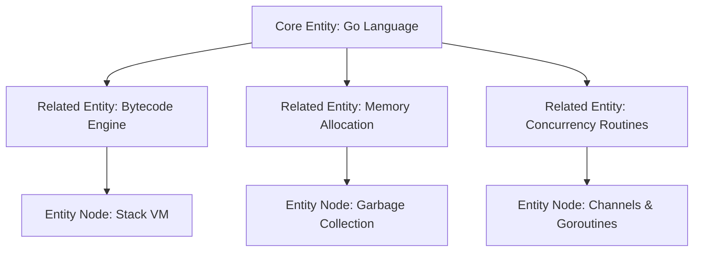

# Semantic SEO & Entity Mapping: Topical Authority & Knowledge Graphs

> **A first-principles guide to Semantic SEO, Google Knowledge Graph entities, topical authority, and LSI semantic relevance mapping.**

---

## 📌 Executive Summary

**Semantic SEO** is the practice of optimizing content around **concepts and entities** rather than isolated keywords. Search engines use Natural Language Processing (NLP) and Knowledge Graphs to understand the relationships between people, places, technologies, and concepts. Establishing **Topical Authority** means thoroughly covering a subject so completely that search engines recognize your domain as an authoritative entity.



---

## 1. What is an Entity in Modern Search?

An **Entity** is a well-defined concept or object that is unique, distinguishable, and machine-readable (e.g., *"Go Programming Language"*, *"Da Nang"*, *"Googlebot"*).

```text
┌───────────────────────────────────────────────────────────────────────────┐
│                      KEYWORD-BASED VS ENTITY-BASED SEO                    │
└───────────────────────────────────────────────────────────────────────────┘
   Keyword Model  ──► Counts word frequency (e.g., "Go web framework" 5x times) [Outdated]
   Entity Model   ──► Understands relationships between Go, HTTP router, VM, and memory [Modern]
```

---

## 2. Establishing Topical Authority

Topical authority is earned when a domain publishes comprehensive, inter-linked coverage across every sub-topic within a specialized domain.

### The 4 Steps to Building Topical Authority

1. **Map the Topic Entity Graph**: Identify all primary, secondary, and tertiary entities associated with your core subject.
2. **Construct Pillar-Cluster Pages**: Write 1 comprehensive Pillar Page for the main entity and 10–20 supporting Cluster articles for related sub-entities.
3. **Contextual Internal Hyperlinking**: Connect sibling articles within the cluster using descriptive anchor text representing the target sub-entity.
4. **Avoid Keyword Cannibalization**: Ensure each URL targets 1 unique entity concept to prevent self-competing in search results.

---

## 3. NLP & Semantic Co-occurrence (LSI) Optimization

Natural Language Processing algorithms evaluate content by scanning for expected **semantic co-occurrences**.

*Example*: If your page is about `"PostgreSQL Optimization"`, search engines expect to find related semantic entities on the page:
- `VACUUM`
- `WAL (Write-Ahead Logging)`
- `B-Tree Indexing`
- `EXPLAIN ANALYZE`
- `Connection Pooling`

If these co-occurring entities are absent, search algorithms deem the content superficial and downgrade its topical depth score.

---

## 4. Summary

Semantic SEO transforms content creation from keyword repetition into entity authority. By mapping entity relationship graphs, writing comprehensive topic clusters, and incorporating expected domain terminology, you build unbreakable topical authority in search engines.
