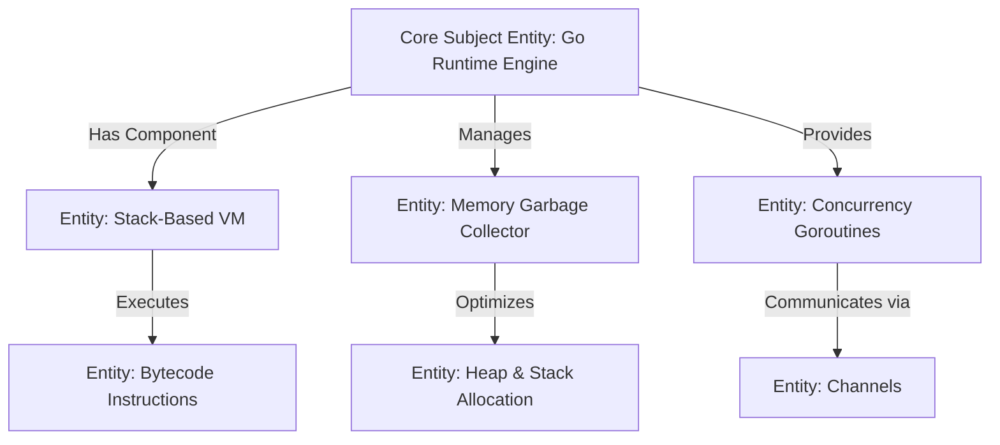

# 🧠 Semantic SEO & Entity Knowledge Graphs

> **SEOER.AI Lab Spec // Module 03: First-principles engineering specification for entity extraction, Knowledge Graphs, LSI co-occurrence, TF-IDF vs BM25 vs Vector embeddings, and topical authority scoring.**

---

## 📌 Executive Summary

**Semantic SEO** is the practice of structuring content around **entities and relationships** rather than literal keyword strings. Modern search engines and AI answer engines do not view web pages as strings of words; they parse pages into **Knowledge Graphs** composed of discrete entity nodes and directional edges. Establishing **Topical Authority** requires covering all connected entities within a subject domain.



---

## 1. Mathematical Scoring: TF-IDF vs. BM25 vs. Vector Embeddings

Search engines evaluate text relevance using three historical and modern algorithmic models:

### A. TF-IDF (Term Frequency - Inverse Document Frequency)
$$\text{TF-IDF}(t, d, D) = \text{TF}(t, d) \times \log \left( \frac{N}{\text{DF}(t)} \right)$$
- Measures how rare and important a word $t$ is across all documents $D$.

### B. BM25 (Best Matching 25 - Industrial Standard)
$$\text{Score}(D, Q) = \sum_{i=1}^{n} \text{IDF}(q_i) \cdot \frac{f(q_i, D) \cdot (k_1 + 1)}{f(q_i, D) + k_1 \cdot \left(1 - b + b \cdot \frac{|D|}{\text{avgdl}}\right)}$$
- Accounts for document length normalization ($|D| / \text{avgdl}$) and term frequency saturation ($k_1$).

### C. Vector Cosine Embedding (Modern AI Search)
Calculates high-dimensional semantic similarity regardless of literal word matching.

---

## 2. Topical Coverage Ratio ($\text{TCR}$) Formula

To achieve unbreakable topical authority in search engines, calculate your domain's **Topical Coverage Ratio**:

$$\text{TCR} = \frac{\text{Published Sub-Entity Topics}}{\text{Total Domain Entity Graph Nodes}} \times 100$$

```text
┌───────────────────────────────────────────────────────────────────────────┐
│                    TOPICAL COVERAGE RATIO SCORECARD                       │
└───────────────────────────────────────────────────────────────────────────┘
   TCR < 40%:  Superficial Coverage (Low Ranking Authority)
   TCR 40-75%: Moderate Authority (Ranks for Long-Tail Only)
   TCR > 80%:  Topical Dominance (Ranks for High-Volume Head Keywords!)
```

---

## 3. Entity Co-occurrence Mapping Matrix

When targeting a primary subject entity, search algorithms expect a predictable set of **co-occurring secondary entities** on the page.

*Example*: Target Entity = `"PostgreSQL Indexing"`

| Expected Co-occurring Entity | Relationship | Search Relevance Impact |
| :--- | :--- | :--- |
| **`B-Tree Index`** | Direct Index Type | ⭐⭐⭐⭐⭐ (Mandatory) |
| **`EXPLAIN ANALYZE`** | Query Diagnostic | ⭐⭐⭐⭐⭐ (Mandatory) |
| **`WAL (Write-Ahead Log)`** | Engine Architecture | ⭐⭐⭐⭐ |
| **`VACUUM FULL`** | Database Maintenance | ⭐⭐⭐⭐ |
| **`pg_stat_user_indexes`** | System View | ⭐⭐⭐ |

---

## 4. Summary

Semantic SEO transforms content creation from keyword repetition into entity graph construction. By calculating BM25 relevance scores, mapping co-occurring entity nodes, and achieving a Topical Coverage Ratio $\text{TCR} \ge 80\%$, you build unshakeable domain topical authority.
