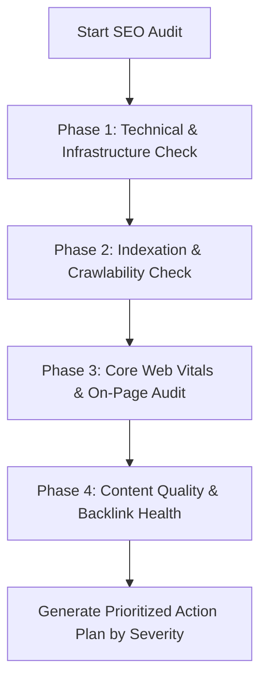

# Technical SEO Audit Framework: 50-Point Inspection Protocol

> **A first-principles guide to performing technical, content, and backlink SEO audits with structured severity scoring.**

---

## 📌 Executive Summary

A **Technical SEO Audit** is a systematic inspection of a website's infrastructure, indexability, content quality, and authority profile to identify bottlenecks suppressing search rankings. A successful audit categorizes issues by **Severity Impact** (Critical, High, Medium, Low) and provides actionable engineering fixes.



---

## 1. The 5-Phase SEO Audit Framework

```text
┌───────────────────────────────────────────────────────────────────────────┐
│                      5-PHASE AUDIT INSPECTION MATRIX                      │
└───────────────────────────────────────────────────────────────────────────┘
   Phase 1: Infrastructure ──► SSL, HTTP Status, Canonicalization, DNS
   Phase 2: Crawl & Index  ──► Robots.txt, XML Sitemaps, Meta Robots Tags
   Phase 3: Performance    ──► LCP, INP, CLS, Mobile-First Parity, JS Render
   Phase 4: On-Page & Schema──► Titles, H1-H3, JSON-LD Microdata, Image ALT
   Phase 5: Off-Page & Links──► Internal Link Depth, Orphan Pages, Toxic Links
```

---

## 2. Priority Severity Matrix & Action Plan

| Severity Level | Issue Description | Expected Impact | Immediate Action |
| :--- | :--- | :--- | :--- |
| 🔴 **CRITICAL** | Whole site blocked via `robots.txt` or `noindex` tag. | Total de-indexation! | Remove blocking rule immediately. |
| 🔴 **CRITICAL** | HTTP 500/503 server error rate $> 5\%$ during crawl. | Rank drop & crawl slowdown. | Fix backend server crash or database locks. |
| 🟠 **HIGH** | Core Web Vitals LCP $> 4.0$ seconds. | Ranking penalty on mobile. | Compress hero images; enable edge caching. |
| 🟠 **HIGH** | Duplicate content without `rel=canonical` tags. | Split PageRank link equity. | Add self-referencing canonical tags. |
| 🟡 **MEDIUM** | Orphan pages with 0 internal links. | Low crawl frequency & rank. | Add contextual internal links from pillar pages. |
| 🟢 **LOW** | Missing ALT text on minor UI icons. | Minor accessibility signal. | Add descriptive ALT attributes. |

---

## 3. Summary

Systematic auditing prevents silent traffic loss. By executing audits across technical infrastructure, indexability, front-end performance, and backlink health, you maintain peak domain search performance.
