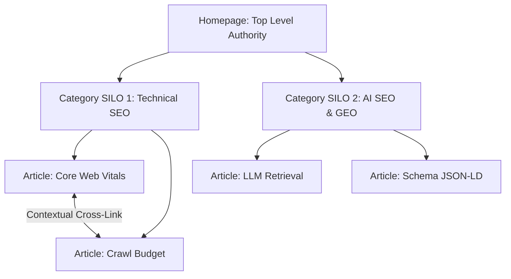

# Site Architecture & Internal SILO Structure for SEO

> **A first-principles guide to website hierarchy, URL depth optimization, SILO internal linking structures, and PageRank distribution.**

---

## 📌 Executive Summary

**Site Architecture** defines how your pages are organized, categorized, and linked together. A clean, logical site structure serves two purposes: it allows users to find content effortlessly and enables search engine crawlers to understand topic hierarchies and distribute link authority (**PageRank**) throughout the entire site.



---

## 1. The 3-Click Depth Rule & Flat Architecture

Search engine crawlers crawl deeper pages less frequently. Keep every indexable page accessible within **3 clicks from the homepage**.

```text
┌───────────────────────────────────────────────────────────────────────────┐
│                      DEEP VS FLAT SITE ARCHITECTURE                       │
└───────────────────────────────────────────────────────────────────────────┘
   DEEP ARCHITECTURE (Bad) ──► Home -> Cat -> Sub-Cat -> Tag -> Page (5 Clicks - Hard to Crawl)
   FLAT ARCHITECTURE (Good)──► Home -> Category SILO -> Target Page (2-3 Clicks - Max PageRank)
```

---

## 2. SILO Architecture Framework

A **SILO Structure** isolates topically related content into distinct, dedicated categories. Pages within a SILO link heavily to each other and to their parent category pillar page, but cross-link to *other* SILOs only through top-level hub pages.

### The 3 Core SILO Rules

1. **Top Pillar Page**: Defines the high-level topic (e.g., `/programmatic-seo`).
2. **Sub-Topic Cluster Pages**: Deep-dive articles addressing specific long-tail keywords (e.g., `/programmatic-seo/data-pipelines`, `/programmatic-seo/templates`).
3. **Strict Vertical & Horizontal Linking**:
   - Sub-topic pages **ALWAYS** link up to the parent Pillar Page.
   - Sub-topic pages link horizontally to sibling sub-topics within the same SILO.

---

## 3. URL Structure Best Practices

Clean, human-readable URLs improve click-through rates (CTR) and keyword relevancy.

| Practice | Good URL Pattern | Bad URL Pattern |
| :--- | :--- | :--- |
| **Short & Keyword-Focused** | `/seo/crawl-budget` | `/blog/2026/07/28/index.php?id=89234` |
| **Hyphens vs Underscores** | `/site-architecture` | `/site_architecture` or `/sitearchitecture` |
| **Lowercase Only** | `/technical-seo` | `/Technical-SEO` (Prevents duplicate content!) |
| **Avoid Parameter Bloat** | `/products/go-runtime` | `/products?id=12&cat=software&lang=en` |

---

## 4. Summary

Site architecture determines how effectively search engines discover and rank your content. By adopting a flat, 3-click maximum depth, implementing tight SILO topical clusters, and maintaining short, clean URL slugs, you maximize PageRank distribution across your domain.
