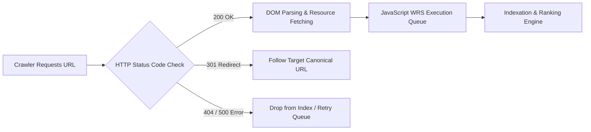

# Technical SEO Fundamentals: Infrastructure, Rendering & HTTP Diagnostics

> **A first-principles engineering guide to technical SEO, HTTP response status codes, rendering pipelines (SSR vs CSR vs SSG), and crawlable web infrastructure.**

---

## 📌 Executive Summary

**Technical SEO** ensures that search engine crawlers (Googlebot, Bingbot, ClaudeBot, PerplexityBot) can efficiently discover, fetch, render, and index every critical URL on your web application. Without clean technical infrastructure, even world-class content will remain invisible in search results.



---

## 1. The Rendering Pipeline: SSR vs. CSR vs. SSG

Search engines process web pages in a 2-wave rendering pipeline:
1. **Wave 1 (HTML Parsing)**: The crawler reads raw static HTML immediately upon receipt.
2. **Wave 2 (WRS Rendering)**: Web Rendering Service (WRS) queues JavaScript execution, which can be delayed by hours or days due to GPU/CPU resource constraints.

```text
┌───────────────────────────────────────────────────────────────────────────┐
│                      RENDERING METHODOLOGY COMPARISON                     │
└───────────────────────────────────────────────────────────────────────────┘
   CSR (Client-Side Render)  ──► Empty HTML <div id="app"> ──► WRS Queue Delay ──► High Risk!
   SSR (Server-Side Render)  ──► Full HTML returned on HTTP 200 ──► Wave 1 Index ──► Best!
   SSG (Static Site Gen)    ──► Pre-compiled HTML at build time ──► Wave 1 Index ──► Fast & Best!
```

| Rendering Model | Initial HTML Content | Crawl Budget Efficiency | Indexing Velocity | Risk Level |
| :--- | :--- | :--- | :--- | :--- |
| **Server-Side Rendering (SSR)** | Full HTML content populated. | ⭐⭐⭐⭐⭐ (Instant) | Instant (Wave 1) | ✅ Low |
| **Static Site Generation (SSG)** | Pre-built static HTML. | ⭐⭐⭐⭐⭐ (Instant) | Instant (Wave 1) | ✅ Low |
| **Client-Side Rendering (CSR)** | Blank shell (`<div id="root"></div>`). | ⭐⭐ (Poor) | Delayed (Wave 2) | ⚠️ High Risk |

---

## 2. Critical HTTP Status Codes Matrix

| Code | Meaning | SEO Impact & Action Required |
| :--- | :--- | :--- |
| **200 OK** | Successful request. | Target status for all indexable canonical URLs. |
| **301 Moved Permanently** | Permanent redirect. | Passes 90-99% PageRank link equity to target URL. |
| **302 Found (Temporary)** | Temporary redirect. | Does NOT pass full link equity long-term; avoid for permanent migrations! |
| **404 Not Found** | Page missing. | Signal to remove URL from index; clean up internal links. |
| **410 Gone** | Explicitly permanently removed. | Faster index removal signal than 404. |
| **500 / 503 Server Error** | Server overload or crash. | Googlebot backs off crawl frequency; prolonged 500s drop rankings! |

---

## 3. The 5-Step Technical Health Diagnostic Checklist

```text
┌───────────────────────────────────────────────────────────────────────────┐
│                   TECHNICAL SEO HEALTH CHECKLIST                          │
└───────────────────────────────────────────────────────────────────────────┘
   [ ] 1. Single Canonical Version: Ensure http://, https://, non-www, and www resolve to 1 single URL.
   [ ] 2. Response Time (TTFB): Time-To-First-Byte must be < 200ms.
   [ ] 3. No Orphan Pages: Every indexable page has at least 1 internal hyperlink.
   [ ] 4. Clean Header Tags: X-Robots-Tag does not block indexing unexpectedly.
   [ ] 5. Valid XML Sitemap: Listed in robots.txt and submitted to Google Search Console.
```

---

## 4. Summary

Technical SEO is the non-negotiable foundation of search visibility. By delivering full HTML via Server-Side Rendering (SSR) or Static Site Generation (SSG), maintaining clean HTTP 200/301 status codes, and eliminating JavaScript rendering delays, you guarantee maximum indexing speed.
