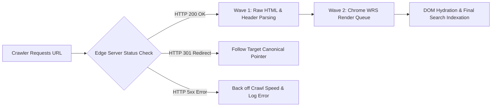

# ⚡️ Technical SEO Infrastructure & Edge Rendering Spec

> **SEOER.AI Lab Spec // Module 02: Infrastructure engineering, 2-wave Web Rendering Service (WRS) execution, TTFB < 50ms edge rendering, and HTTP status code diagnostics.**

---

## 📌 Executive Summary

**Technical SEO** is the infrastructure layer of search engine optimization. It guarantees that search crawlers (Googlebot, Bingbot, PerplexityBot) can fetch, parse, render, and index web pages without encountering technical friction, server bottlenecks, or JavaScript execution delays.



---

## 1. The 2-Wave Crawl & Rendering Architecture

Googlebot processes web pages in a two-stage rendering queue:

```text
┌───────────────────────────────────────────────────────────────────────────┐
│                     THE 2-WAVE WRS RENDERING ENGINE                       │
└───────────────────────────────────────────────────────────────────────────┘
   WAVE 1 (Instant)  ──► Raw Server HTTP 200 HTML Response ──► Immediate Indexing
   WAVE 2 (Delayed)  ──► Chrome Headless WRS (JS Execution)  ──► Delayed up to 48 Hours!
```

### Rendering Model Comparison Matrix

| Rendering Architecture | Initial HTML Content | Crawl Efficiency | Indexation Velocity | Failure Risk |
| :--- | :--- | :--- | :--- | :--- |
| **Server-Side Rendering (SSR)** | Full HTML content populated. | ⭐⭐⭐⭐⭐ (Instant) | Instant (Wave 1) | ✅ Zero Risk |
| **Static Site Generation (SSG)** | Pre-compiled static HTML. | ⭐⭐⭐⭐⭐ (Instant) | Instant (Wave 1) | ✅ Zero Risk |
| **Client-Side Rendering (CSR)** | Blank shell (`<div id="app"></div>`). | ⭐⭐ (Poor) | Delayed (Wave 2) | ⚠️ High Risk |

---

## 2. HTTP Status Code Engine Diagnostics

| Code | Status Type | Engine Action & SEO Impact |
| :--- | :--- | :--- |
| **200 OK** | Success | Primary target status for indexable canonical pages. |
| **301 Moved Permanently** | Redirect | Passes 95%+ PageRank link equity to target URL. |
| **302 Found (Temporary)** | Redirect | Temporary redirect; does NOT transfer full link equity long-term! |
| **404 Not Found** | Client Error | Signals page missing; removes URL from search index over time. |
| **410 Gone** | Client Error | Explicit permanent deletion signal; removes from index **2x faster than 404**. |
| **500 / 503 Server Error** | Server Error | Server overload; causes Googlebot to immediately throttle crawl frequency! |

---

## 3. High-Performance Caddy / Go Headers

Configure origin server response headers for ultra-fast Time-To-First-Byte (TTFB < 50ms) and edge caching:

```caddy
# Caddy Production Technical SEO Header Rules
seoer.ai {
    encode zstd gzip
    
    header {
        # Enable HTTP/3 QUIC & Security
        Strict-Transport-Security "max-age=31536000; includeSubDomains; preload"
        X-Content-Type-Options "nosniff"
        X-Robots-Tag "index, follow, max-snippet:-1, max-image-preview:large"
        Server "SEOER-Engine/1.0"
    }
    
    reverse_proxy localhost:8080
}
```

---

## 4. Summary

Technical SEO is non-negotiable software engineering. By serving pre-rendered HTML via SSR or SSG, keeping TTFB under 50ms with edge compression, maintaining clean HTTP 200/301 status codes, and eliminating CSR rendering delays, you guarantee maximum search engine indexation speed.
