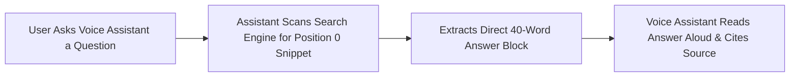

# Voice & Conversational Search: Position 0 & Speakable Microdata

> **A first-principles guide to voice search optimization, capturing Position 0 Featured Snippets, conversational query structures, and Speakable Schema.org microdata.**

---

## 📌 Executive Summary

**Voice & Conversational Search** optimizes content for voice assistants (Google Assistant, Apple Siri, Amazon Alexa) and conversational AI interfaces. Voice queries are longer, phrased in natural spoken language, and typically read aloud a single **Featured Snippet (Position 0)** answer.



---

## 1. Capturing Position 0 Featured Snippets

Featured Snippets appear above search result #1. Winning Position 0 requires structuring answers to match 3 target snippet formats:

```text
┌───────────────────────────────────────────────────────────────────────────┐
│                      FEATURED SNIPPET FORMAT MATRIX                       │
└───────────────────────────────────────────────────────────────────────────┘
   1. Paragraph Snippets ──► Provide concise 40 to 50 word bolded definition.
   2. List Snippets      ──► Format steps using ordered <ol> or <ul> lists.
   3. Table Snippets     ──► Present comparative data inside <table> tags.
```

---

## 2. Speakable Schema.org Microdata Syntax

Identify sections of your article suitable for text-to-speech audio playback by embedding `Speakable` schema:

```html
<script type="application/ld+json">
{
  "@context": "https://schema.org",
  "@type": "WebPage",
  "name": "Technical SEO Overview",
  "speakable": {
    "@type": "SpeakableSpecification",
    "cssSelector": [".speakable-summary", "#executive-summary"]
  }
}
</script>
```

---

## 3. Summary

Conversational search rewards clarity and structured formatting. By targeting Position 0 featured snippets with concise 40-word paragraph answers, HTML lists, and Speakable JSON-LD microdata, you capture voice search queries.
